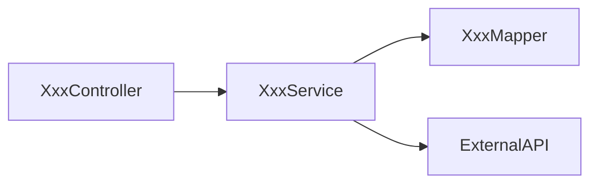
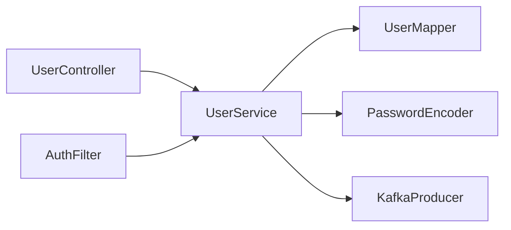

# 代码自文档体系

建立**自底向上的三层代码自文档系统**，让 AI 在任何粒度切入项目时都能快速理解上下文。

## ⚠️ 铁律提醒

- 每次回复先称呼 **Boss**
- 不确定的设计决策**必须先问 Boss**
- **不写兼容性代码**，除非 Boss 主动要求

---

## 核心设计理念

AI 读懂模块有两种路径：（1）读每个文件的头部三行注释；（2）读目录级 `CONTEXT.md`。本体系以 **`CONTEXT.md` 为主力**，文件头部三行注释仅作为"一次性初始化标签"，不参与 `/doc-sync` 增量更新流程。

**为什么这样划分？**

- ✅ **PR 噪音归零**：`/doc-sync` 只改 `CONTEXT.md`，源码文件在"职责实质变化"之外永不被自动改写，保持外科手术式修改
- ✅ **文档内容可深化**：`CONTEXT.md` 支持 L0/L1/L2 分层节（见下方第二层），能承载调用关系图、设计决策、故障模式等源码注释装不下的信息
- ✅ **与 Repo Wiki / GitNexus 互补**：GitNexus 给跨模块调用链（重），`CONTEXT.md` 给模块内业务文档（轻）

### 🚫 准确性铁律（强制约束）

**所有文档内容必须基于实际代码，严禁凭推测或经验猜测生成。** 以下行为全部禁止：

- ❌ 没有读完文件就写 INPUT/OUTPUT/POS 注释
- ❌ 根据文件名或类名猜测文件职责（如看到 `UserService` 就写"用户管理"而不读代码）
- ❌ 从旧注释复制内容而不验证是否与当前代码一致
- ❌ `CONTEXT.md` 中的"逻辑"和"约束"描述未经代码验证
- ❌ 业务域清单中的"职责简述"与文件实际内容不符
- ❌ 设计决策节（Decisions & Gotchas）凭空编造历史——无来源的条目必须删除或询问 Boss

**正确做法**：

1. **先读后写**：必须完整阅读文件源码后，才能编写该文件的相关文档
2. **逐条验证 INPUT**：检查文件的 import/require/include 语句，确认实际依赖了什么
3. **逐条验证 OUTPUT**：检查文件的 export/public 方法/对外接口，确认实际提供了什么
4. **逐条验证 POS**：根据目录结构和调用关系确认文件在系统中的实际位置
5. **`CONTEXT.md` 必须基于子文件的实际内容汇总**，不得凭目录名推测模块职责
6. **所有结论必须带代码锚点**：`file.java:123` 或 `functionName()`；没有锚点等于空话

三层文档形成一棵**自下而上的知识树**：

```
项目根目录/
├── CONTEXT.md              ← 第三层：全局业务域地图
├── src/
│   ├── CONTEXT.md          ← 第二层：src 目录的模块清单
│   ├── user/
│   │   ├── CONTEXT.md      ← 第二层：user 模块概述 + 子文件清单
│   │   ├── UserService.java  ← 第一层：头部三行注释
│   │   ├── UserController.java
│   │   └── UserMapper.java
│   ├── order/
│   │   ├── CONTEXT.md
│   │   ├── OrderService.java
│   │   └── ...
│   └── common/
│       ├── CONTEXT.md
│       └── ...
```

---

## 第一层：源码文件头部三行注释（一次性初始化标签）

### 定位与生命周期

- ✅ 仅在 `/doc-init` 首次初始化时**可选**写入，作为文件级"轻标签"辅助 AI 冷启动
- ❌ `/doc-sync` **不再更新**源码文件头部注释——源码文件只在业务实质变化时由开发者主动修改
- ❌ `/extend`、`/fix-bug`、`/code-review` 等常规流程**不得**以"文档同步"为由修改源码文件头部注释
- ⚠️ 如果头部注释与代码出现偏差：**优先修正 `CONTEXT.md`**，头部注释等下次 `/doc-init --rebuild` 时整体刷新

**目标**：让 PR diff 中**零源码噪音**——源码文件的变更永远只反映业务/功能改动，文档同步全部落在 `CONTEXT.md`。

### 规则

如果 Boss 在 `/doc-init` 时选择写入头部注释，**每个源码文件**的头部可包含三行注释（位于 package/import 声明之前，或文件最顶部）：

```
// INPUT:  依赖什么（被谁驱动、消费什么数据、调用什么外部服务）
// OUTPUT: 提供什么（对外暴露的能力、产出的数据、发出的事件）
// POS:    在系统中的地位（属于哪个模块、扮演什么角色、处于架构的哪一层）
```

### 各语言格式

**Java / C / C++ / Go / Rust / JavaScript / TypeScript：**
```java
// INPUT:  UserMapper(数据库查询), PasswordEncoder(密码加密), RoleService(角色信息)
// OUTPUT: 用户注册/登录/信息修改能力, 用户认证token
// POS:    user模块 > 业务逻辑层, 用户领域核心服务
package com.example.user.service;
```

**Python：**
```python
# INPUT:  user_repository(数据库操作), password_util(密码工具), role_service(角色服务)
# OUTPUT: 用户注册/登录/信息查询能力, 认证token生成
# POS:    user模块 > service层, 用户领域核心服务

from user.repository import UserRepository
```

**Vue / JSX / TSX：**
```vue
<!-- INPUT:  userStore(用户状态), api/user(用户接口), ElMessage(提示组件) -->
<!-- OUTPUT: 用户登录页面, 登录成功后路由跳转 -->
<!-- POS:    views/user模块, 用户登录入口页面 -->
<template>
```

**SQL 脚本：**
```sql
-- INPUT:  无外部依赖
-- OUTPUT: t_user表结构(用户基础信息存储)
-- POS:    数据库层 > user模块, 用户数据表定义
```

**Shell / Bash：**
```bash
#!/bin/bash
# INPUT:  环境变量(DB_HOST, DB_PORT), config/app.yml(应用配置)
# OUTPUT: 应用启动, 端口监听(8080)
# POS:    部署脚本, 应用启动入口
```

**CSS / SCSS / Less：**
```css
/* INPUT:  variables.scss(主题变量), mixins.scss(公共混入) */
/* OUTPUT: 用户模块页面样式(登录页/注册页/个人中心) */
/* POS:    styles/user模块, 用户相关页面样式集合 */
```

### 编写原则

1. **简洁精准** — 每行控制在 80 字符以内，用逗号分隔多个条目
2. **业务语言** — 用业务术语而非纯技术术语（"用户认证" 而非 "JWT 生成"）
3. **关系明确** — INPUT 说清楚"从哪来"，OUTPUT 说清楚"到哪去"
4. **定位清晰** — POS 包含模块归属 + 架构层级 + 角色描述

### 幂等性：禁止重复写入

**在添加头部注释前，必须先检查文件是否已包含 `// INPUT:` / `# INPUT:` / `<!-- INPUT:` 注释。** 如果已存在，则**跳过**（不再更新）；`/doc-sync` 禁止修改源码头部。

检测逻辑（伪代码）：
```
读取文件前 10 行
如果匹配到 "INPUT:" 或 "OUTPUT:" 或 "POS:" 关键字：
  → 跳过（头部已有标签，属于既有初始化产物）
否则（仅在 /doc-init 首次初始化且 Boss 授权写入时）：
  → 在正确位置插入新的三行注释
/doc-sync 不在此分支，永不写入源码文件
```

**这是强制约束**——`/doc-sync` 多次运行**不得修改任何源码文件**；仅 `/doc-init --rebuild` 可整体刷新（需 Boss 显式确认）。

### 什么文件需要加

| 文件类型 | 是否需要 | 说明 |
|---|---|---|
| 业务逻辑代码 | ✅ 必须 | Service、Controller、Model 等 |
| 工具类/公共组件 | ✅ 必须 | Utils、Common、Shared 等 |
| 配置文件代码 | ✅ 必须 | 路由配置、数据库配置等 |
| 测试文件 | ✅ 必须 | INPUT 写被测对象，OUTPUT 写验证了什么 |
| 纯静态资源 | ❌ 不需要 | 图片、字体、纯 JSON 数据文件 |
| **自动生成代码** | ❌ **禁止** | 见下方完整清单 |
| 第三方库代码 | ❌ 不需要 | node_modules、vendor 等 |

### 自动生成代码识别（禁止添加注释）

**以下文件和目录是自动生成的，禁止添加三行注释，也不需要 CONTEXT.md。** AI 必须通过文件名模式、文件头部标记、目录名称三种方式综合判断。

#### 方式一：文件头部包含生成标记

如果文件前 5 行包含以下任意标记，判定为自动生成：

```
"Code generated"
"DO NOT EDIT"
"AUTO-GENERATED"
"auto generated"
"Generated by"
"generated by"
"This file was generated"
"This is a generated file"
"@generated"
"@auto-generated"
"Autogenerated"
"GENERATED FILE"
```

#### 方式二：文件名模式匹配

| 模式 | 工具 | 语言 |
|---|---|---|
| `*.pb.go` `*.pb.cc` `*.pb.h` `*.pb.py` `*_pb2.py` `*_pb2_grpc.py` | Protocol Buffers (protoc) | Go/C++/Python |
| `*.pb.swift` `*.pb.rs` `*.pb.ts` | Protocol Buffers | Swift/Rust/TS |
| `*.grpc.go` `*_grpc.pb.go` | gRPC codegen | Go |
| `*.gen.go` `*_gen.go` `*_generated.go` | go:generate | Go |
| `*.g.dart` `*.freezed.dart` | build_runner / Freezed | Dart/Flutter |
| `*.generated.ts` `*.generated.js` | 各类 TS/JS codegen | TypeScript/JS |
| `*_string.go` `*_enumer.go` | stringer / enumer | Go |
| `*.swagger.json` `*.swagger.yaml` | Swagger/OpenAPI codegen | 通用 |
| `*_mock.go` `*_mock.java` `*Mock.ts` | mockgen / Mockito / jest mock | Go/Java/TS |
| `*.ent.go` `*_query.go` `*_update.go` `*_create.go` `*_delete.go` | Ent ORM | Go |
| `*.gorm.go` | GORM gen | Go |
| `*_sqlc.go` `*.sql.go` | sqlc | Go |
| `*_easyjson.go` | easyjson | Go |
| `*.deepcopy.go` `*_deepcopy.go` | controller-gen (K8s) | Go |
| `zz_generated.*.go` | Kubernetes code-generator | Go |
| `*.thrift.go` `*-remote/` | Apache Thrift | Go |
| `*_wire_gen.go` | Wire (DI) | Go |
| `R.java` `BuildConfig.java` `*$$*.java` | Android Gradle / APT | Java |
| `*.g.cs` `*.designer.cs` | Visual Studio / T4 / EF | C# |
| `moc_*.cpp` `ui_*.h` `qrc_*.cpp` | Qt moc/uic/rcc | C++ |
| `*_automoc.cpp` | CMake automoc | C++ |
| `lex.yy.c` `y.tab.c` `y.tab.h` | Flex / Bison (Yacc) | C/C++ |
| `*.y.go` `*.l.go` | goyacc / golex | Go |
| `*_string.go` | Go stringer tool | Go |
| `migrations/*.py` `migrations/*.sql` | Django / Alembic / Flyway | Python/SQL |

#### 方式三：目录名整体排除

以下目录下的**所有文件**均视为自动生成或第三方代码：

```
node_modules/     vendor/        .git/          .svn/
dist/             build/         out/           target/
__pycache__/      .next/         .nuxt/         .output/
generated/        gen/           auto_gen/      codegen/
.generated/       pb/            proto_gen/     api_gen/
wire_gen/         ent/migrate/   ent/schema/    prisma/client/
```

**如果不确定某个文件是否为自动生成——查看文件头部前 5 行。**

---

## 第二层：模块目录 CONTEXT.md（文档主力）

### 规则

**每个业务模块目录**下必须放置一个 `CONTEXT.md`。本层是三层自文档体系的**唯一信息承载主力**，源码文件头部注释不参与同步。

### 节结构分层：L0 必备 / L1 核心模块追加 / L2 按需

> **设计原则**（反对"平铺 12 节堆砌"，按模块特征动态选择）：
> - **L0 六节**是所有 `CONTEXT.md` 必备，工具类/配置目录/边缘模块止步于此
> - **L1 三节**仅在"核心业务模块"（Controller/Service/领域核心）追加
> - **L2 三节**按模块特性按需追加（独立监控面板、测试复杂度、高频演进）
> - 单个 `CONTEXT.md` **总行数 ≤ 300 行**，超了说明模块该拆或信息该外链

#### 核心模块判定规则

自动判为 L1（由 `/doc-init` 与 `/doc-sync` 结合 GitNexus 模式 C 的 blast radius 判定）：

- 被调用次数 ≥ 10（GitNexus 图谱统计）
- 目录内存在 `*Service.*` / `*Controller.*` / `*Handler.*` / 领域核心文件
- 或 Boss 在 `/doc-init` 时显式标注为 `level=L1`

其他情形默认 L0。模块是否升级到 L1 / 追加哪些 L2 节，由 AI 提案 + Boss 确认决定，不得自动追加。

---

### L0 必备六节（所有 CONTEXT.md）

```markdown
# [模块名称]

## ① 地位（Position）
[1-3 句话：这个模块在系统中扮演什么角色？属于哪个业务领域？处于架构哪一层？被谁依赖？]

## ② 逻辑（Logic）
[核心业务流程，步骤式描述，不超过 7 步；每步可带代码锚点]
1. [步骤 1]（锚点：`file.java:NNN`）
2. [步骤 2]
...

## ③ 约束（Constraints）
> 每条必须带代码锚点或配置来源，禁止凭经验臆造
- 调用约束：[例] 禁止绕过 `UserService` 直连 `UserMapper`（见 `UserMapper.java:10` 的 @Internal 注解）
- 数据约束：[例] 用户名 3-32 字符（`UserValidator.java:42`）
- 性能约束：[例] 登录响应 P99 < 200ms（监控面板 `OpsDashboard §P99`）
- 安全约束：[例] 密码 BCrypt 存储（`UserService.java:88`），token 有效期 2h（`JwtConfig.java:18`）

## ④ 业务域清单（Inventory）
> 完整文件档案：名 / 类型 / 职责 / INPUT / OUTPUT / 调用者 / 注意事项
> 由 GitNexus 模式 A + B 自动生成，AI 补业务语义

| 文件/子模块 | 类型 | 职责 | INPUT | OUTPUT | 调用者 | 注意 |
|---|---|---|---|---|---|---|
| `XxxService.java` | 核心服务 | 一句话职责 | [依赖的组件/服务] | [暴露的能力] | [主要调用者] | [不动区 / N+1 风险 / 锚点] |
| `dto/` | 子目录 | 数据传输对象 | — | — | — | — |

## ⑤ 调用关系（Dependencies）
> 由 GitNexus 模式 A/C 自动生成；展开深度 ≤ 2，深层调用链交给 Repo Wiki / GitNexus 查询



| 维度 | 值 |
|---|---|
| 被调用次数 | [N] 处（blast radius: low/medium/high） |
| 外部服务依赖 | [MySQL / Redis / Kafka / ...] |
| 最高风险依赖 | [例：Kafka 同步阻塞点] |

## ⑥ 设计决策与踩坑（Decisions & Gotchas）⭐核心价值
> 本节是 AI **无法替代**的手写节——记录"为什么这样设计"和"历史踩过的坑"。
> 首次可为空；每次重大设计变更后由 Boss 追加一条，防止成为 TODO 坟场。

- **不变量**：[例] 密码必须 BCrypt，不得改 MD5（历史漏洞 `SEC-2023-07`）
- **设计原因**：[例] 同步发 Kafka 而非异步 —— 需强一致用户事件（见 `docs/adr/0012-user-event-sync.md`）
- **已知坑**：[例] `listUsers()` 存在 N+1 查询，超过 100 条必须改用 `listUsersBatch()`（`UserService.java:156`）
```

### L1 核心模块追加三节（Controller / Service / 领域核心）

```markdown
## ⑦ 数据流（Data Flow）
> 关键数据结构 + 流转路径

[例]
```
HTTP Request → UserRegisterDTO → UserDomain(脱敏) → UserEntity → MySQL
                                                  ↓
                                              UserEvent → Kafka
```

## ⑧ 扩展点（Extension Points）⭐ /extend 流程前置读取
> 明确"加新需求最佳位置"和"禁止修改的核心不动区"，对接 `/extend` 的 Karpathy §3 外科手术原则

- ✅ **可扩展位置**：
  - 加新业务字段：修改 `UserDomain.java` + 对应 DTO（非不动区）
  - 加新登录方式：实现 `LoginStrategy` 接口（`strategy/` 目录）
- ❌ **不动区**（改动必须 Boss 评审）：
  - `UserService.register()` 的幂等性逻辑
  - `UserMapper.xml` 的核心 SQL 模板

## ⑨ 故障模式（Failure Modes）
> 常见故障场景 + 降级策略

| 故障 | 征兆 | 降级方案 |
|---|---|---|
| DB 不可用 | 注册/登录超时 | 写入失败队列，告警，返回友好错误 |
| Redis 不可用 | token 校验失败 | 回源 DB 校验 + 限流 |
| Kafka 不可用 | 用户事件发送失败 | 落库重试，不阻塞主链路 |
```

### L2 按需追加三节

```markdown
## ⑩ 可观测性（Observability）
> 有独立监控面板 / 告警的模块

- 关键日志锚点：`UserService.java:88` 登录日志 / `UserService.java:156` 密码错误日志
- 监控指标：P99 延迟、登录成功率、token 生成速率
- 告警面板：[链接或面板名]

## ⑪ 测试策略（Testing Strategy）
> 测试复杂的模块（Mock 多 / 异步多 / 依赖外部服务）

- 框架：JUnit 5 + Mockito
- 运行命令：`mvn test -Dtest=UserServiceTest`
- 关键用例：
  - 并发注册幂等性：`UserServiceTest.java:120`
  - token 过期边界：`UserServiceTest.java:240`

## ⑫ 变更锚点（Change History）
> 频繁演进的模块

最近 5 次重要变更（由 `git log --oneline -5 -- <dir>` 自动刷新）：
- `abc1234` 2026-04-15 feat: 支持 OAuth2 登录（PR #1234）
- ...
```

---

### 完整示例（L1 核心模块）

```markdown
# 用户模块（user）

## ① 地位
系统核心业务模块，负责用户全生命周期。被订单、权限、消息模块依赖（共 47 处调用）。业务逻辑层。

## ② 逻辑
1. 注册：校验 → 加密 → 入库 → 发 UserEvent（`UserService.java:42`）
2. 登录：验证 → 生成 token → 记录日志（`UserService.java:78`）
3. 信息管理：查询/修改/头像上传（`UserController.java:120`）

## ③ 约束
- 密码 BCrypt 存储（`UserService.java:88`）
- token 有效期 2 小时（`JwtConfig.java:18`）
- 登录接口 P99 < 200ms（监控面板 `OpsDashboard §P99`）
- 禁止绕过 UserService 直连 UserMapper（架构约束）

## ④ 业务域清单

| 文件 | 类型 | 职责 | INPUT | OUTPUT | 调用者 | 注意 |
|---|---|---|---|---|---|---|
| `UserController.java` | 接口层 | REST API 端点 | UserService, 校验注解 | REST JSON | 前端、第三方 | — |
| `UserService.java` | 核心服务 | 用户业务逻辑 | UserMapper, PasswordEncoder, KafkaProducer | 注册/登录/token 能力 | UserController, AuthFilter | 禁止绕过 Service 直连 Mapper |
| `UserMapper.java` | 数据层 | 用户 DB 操作 | MyBatis | CRUD 接口 | UserService | 所有 SQL 见 UserMapper.xml |
| `dto/` | 子目录 | DTO 定义 | — | — | — | — |

## ⑤ 调用关系



| 维度 | 值 |
|---|---|
| 被调用次数 | 47 处（blast radius: medium） |
| 外部服务依赖 | MySQL / Redis / Kafka |
| 最高风险依赖 | KafkaProducer（同步阻塞点） |

## ⑥ 设计决策与踩坑
- **不变量**：密码必须 BCrypt，不得改 MD5（历史漏洞 SEC-2023-07）
- **同步发 Kafka 而非异步**：需强一致用户事件（见 `docs/adr/0012-user-event-sync.md`，2024-03 讨论）
- **已知坑**：`listUsers()` N+1 查询，超过 100 条必须改用 `listUsersBatch()`（`UserService.java:156`）

## ⑦ 数据流
```
HTTP Request → UserRegisterDTO → UserDomain(脱敏) → UserEntity → MySQL
                                                  ↓
                                              UserEvent → Kafka
```

## ⑧ 扩展点
- ✅ 加新业务字段：`UserDomain.java` + 对应 DTO
- ✅ 加新登录方式：实现 `LoginStrategy` 接口（`strategy/` 目录）
- ❌ 不动区：`UserService.register()` 的幂等性逻辑，改动必须 Boss 评审

## ⑨ 故障模式
| 故障 | 征兆 | 降级方案 |
|---|---|---|
| DB 不可用 | register 超时 | 写入失败队列，告警 |
| Redis 不可用 | token 校验降级 | 回源 DB 校验 + 限流 |
| Kafka 不可用 | 事件失败 | 落库重试，不阻塞主链路 |
```

### 反面约束（不要写进 CONTEXT.md）

| ❌ 不加 | 原因 |
|---|---|
| 完整 API 文档 | 重复且易过期，交给 OpenAPI / Javadoc |
| 字段级数据模型 | 重复 Schema/Entity 定义，用链接代替 |
| 详细使用示例 | 重复 README / 单测，保留 1 个最小 snippet 即可 |
| 依赖版本号 | 重复 `package.json` / `pom.xml`，信息会漂移 |
| 团队 / Owner 信息 | 放 `CODEOWNERS` 而非 `CONTEXT.md`，人员流动快 |
| 待办事项 / TODO | 进工单系统，不污染文档 |

### 嵌套目录的 CONTEXT.md

对于多层嵌套的项目，**每一层业务目录**都有自己的 `CONTEXT.md`：

#### Java/Spring 项目典型结构

```
src/
├── CONTEXT.md              ← 列出所有顶层业务模块
├── user/
│   ├── CONTEXT.md          ← user 模块概述 + 下属文件清单
│   ├── dto/
│   │   └── CONTEXT.md      ← dto 子目录的文件清单
│   └── ...
├── order/
│   ├── CONTEXT.md
│   └── ...
```

#### Go 项目典型结构

```
project-root/
├── CONTEXT.md                ← 全局：列出 cmd/ internal/ pkg/ 等
├── cmd/
│   ├── CONTEXT.md            ← 列出所有可执行入口
│   ├── server/
│   │   ├── CONTEXT.md        ← server 入口的说明
│   │   └── main.go
│   └── worker/
│       ├── CONTEXT.md
│       └── main.go
├── internal/
│   ├── CONTEXT.md            ← 列出所有内部模块
│   ├── user/
│   │   ├── CONTEXT.md
│   │   ├── handler.go
│   │   ├── service.go
│   │   ├── repository.go
│   │   └── model.go
│   ├── order/
│   │   ├── CONTEXT.md
│   │   └── ...
│   └── middleware/
│       ├── CONTEXT.md
│       └── auth.go
├── pkg/
│   ├── CONTEXT.md
│   ├── logger/
│   │   ├── CONTEXT.md
│   │   └── logger.go
│   └── httpclient/
│       ├── CONTEXT.md
│       └── client.go
├── api/
│   └── (自动生成代码，不加注释)
└── configs/
    └── config.yaml
```

**Go 项目特别注意**：
- `internal/` 下的**每个 package 目录**都必须有 `CONTEXT.md`，即使只有 1-2 个文件
- `cmd/xxx/` 下的每个入口目录都必须有 `CONTEXT.md`
- `pkg/` 下的每个公共包都必须有 `CONTEXT.md`
- `api/` `proto/` `gen/` `pb/` 等自动生成目录排除

#### C/C++ 项目典型结构

```
project-root/
├── CONTEXT.md                ← 全局：列出所有模块
├── src/
│   ├── CONTEXT.md            ← 列出所有源码模块
│   ├── core/
│   │   ├── CONTEXT.md
│   │   ├── engine.cpp
│   │   └── engine.h
│   ├── network/
│   │   ├── CONTEXT.md
│   │   ├── tcp_server.cpp
│   │   ├── tcp_server.h
│   │   └── protocol.h
│   └── utils/
│       ├── CONTEXT.md
│       └── string_util.cpp
├── include/
│   ├── CONTEXT.md
│   └── project/
│       └── api.h
├── tests/
│   ├── CONTEXT.md
│   └── ...
└── third_party/                ← 第三方（排除）
```

**C/C++ 项目特别注意**：
- `.h` 头文件和 `.cpp`/`.c` 源文件都需要三行注释
- `third_party/` `external/` `deps/` 目录排除
- CMake 生成的 `build/` 目录排除
- Qt 项目的 `moc_*` `ui_*` `qrc_*` 文件排除（自动生成）

上层 `CONTEXT.md` 的"业务域清单"中引用下层目录时，一句话概括即可：

```markdown
| `user/` | 业务模块 | 用户全生命周期管理（注册/登录/信息/密码） |
| `order/` | 业务模块 | 订单创建、查询、状态流转、退款 |
```

**不需要 CONTEXT.md 的目录**：
- `node_modules/`、`vendor/`、`.git/`、`.svn/` 等第三方/系统目录
- 只包含纯静态资源的目录（如 `public/images/`）
- 自动生成代码的目录

### CONTEXT.md 准确性验证流程

生成或更新 CONTEXT.md 时，必须执行以下验证：

1. **地位（Position）验证**：阅读该目录下所有文件的实际 import/export，确认模块在系统中的真实角色，不得仅凭目录名推断
2. **逻辑（Logic）验证**：通读核心业务代码，提取实际处理流程，不得编造不存在的业务逻辑
3. **约束（Constraints）验证**：从代码中的校验逻辑、配置常量、注释中提取真实约束，不得凭经验臆造
4. **业务域清单验证**：逐个核对目录下的文件/子目录是否都已列出，职责简述是否与文件实际内容一致
5. **交叉验证**：CONTEXT.md 中描述的模块间依赖关系，必须与实际代码的 import 语句一致

---

## 第三层：级联更新规则（只改 CONTEXT.md，不碰源码）

### 核心规则

**每次源码发生变动时，自动逐级更新 `CONTEXT.md`**；但严格禁止在文档同步中修改源码文件。

### 🚫 禁止条款（硬门禁）

1. `/doc-sync` **不得修改任何源码文件**（含头部三行注释）
2. 级联更新只在**变更文件的直接父目录**触发；上层 `CONTEXT.md` 仅在"子模块一句话描述变了"时才动，不做盲目传播
3. "间接影响"的文件**不更新其头部注释**——间接影响只在目标目录的 `CONTEXT.md §⑤ 调用关系`中体现

### 更新触发条件

| 变动类型 | 更新范围 |
|---|---|
| 新增源码文件 | ① 所在目录 `CONTEXT.md` ④ 的 Inventory 表新增一行；② 如新文件改变模块对外能力，更新 ② 逻辑 / ⑤ 调用关系 |
| 修改源码文件（接口/职责变化） | ① 所在目录 `CONTEXT.md` Inventory 行更新 INPUT/OUTPUT/调用者；② 如果职责描述变了，更新 ① 地位 / ② 逻辑 |
| 删除源码文件 | ① 所在目录 `CONTEXT.md` Inventory 删行；② 如对外 API 缩减，更新 ② 逻辑 |
| 新增目录/模块 | ① 新目录 `CONTEXT.md`（按 L0/L1 模板生成）；② **仅更新上一层** `CONTEXT.md` 的子模块概述 |
| 移动/重命名文件 | 等同于 删除 + 新增（两端 `CONTEXT.md` 都改；源码文件头部不动） |
| 纯内部逻辑修改（接口不变） | **不更新文档**；除非 ⑥ 设计决策节需追加踩坑条目（仅 Boss 可加） |
| 调用关系变化（如新增外部服务调用） | 更新 `CONTEXT.md §⑤` 的 Mermaid 图（由 GitNexus 模式 A/C 刷新） |
| 重大设计变更 | 追加 `CONTEXT.md §⑥ 设计决策与踩坑` 条目（Boss 追加） |

### 更新流程

```
源码变更（由开发者本次修改产生）
  ↓
① GitNexus 模式 C 检测变更文件 + 直接影响面
  ↓
② 对每个变更文件的直接父目录：更新 CONTEXT.md 的 Inventory 行 + 逻辑/约束/调用关系节
  ↓
③ 仅当子模块"一句话概述"发生变化时，更新上一层 CONTEXT.md 的对应行
  ↓
④ 绝不再向更上层传播（避免级联放大）
  ↓
⑤ 源码文件在本流程中一行都不改（Karpathy §3 外科手术原则）
```

### 更新粒度控制

**不要过度更新**。判断标准：

- 文件内部 bug 修复、性能优化 → **通常不更新 CONTEXT.md**（接口和职责没变）
- 新增公共方法 / 对外接口变化 → 更新所在目录 `CONTEXT.md §④ Inventory` 的 OUTPUT 列
- 新增文件 → 更新所在目录 `CONTEXT.md`；**仅在**子模块概述需改时再动上层
- 重构模块结构 → 全面更新涉及目录的 `CONTEXT.md`
- 出现"血泪踩坑"→ 必须追加到 `CONTEXT.md §⑥`（由 Boss 拍板内容）

**如果不确定是否需要更新，问 Boss。**

---

## 新项目初始化

对于新项目或尚未建立文档体系的已有项目，使用 `/doc-init` 命令进行全量初始化：

1. 扫描项目目录结构
2. 识别所有业务模块目录
3. 分析每个源码文件的依赖、输出、定位
4. **询问 Boss**：是否写入头部三行注释（可选，作为一次性初始化标签）
5. 为每个业务模块目录生成 `CONTEXT.md`（按 L0/L1/L2 动态决定节数量）
6. 自底向上逐级汇总——但**仅汇总到直接父目录**，不盲目全量贯穿
7. 向 Boss 展示文档结构，确认无误后批量写入
8. 写入后将 `level=L0/L1` 记录到 `.codebuddy/state/doc-level.json`，供 `/doc-sync` 参考

## 手动触发全量同步

当文档与代码出现较大偏差时，使用 `/doc-sync` 命令：

1. 对比现有 `CONTEXT.md` 与实际代码（使用 GitNexus 模式 C）
2. 找出不一致的地方
3. 向 Boss 报告差异（表格形式）
4. 确认后批量更新 `CONTEXT.md`——**源码文件不动**

---

## 读取代码时的使用方式

当你需要理解一个陌生模块时，按以下顺序阅读：

```
1. 项目根目录 CONTEXT.md     → 了解项目全貌和模块划分
2. 目标模块的 CONTEXT.md      → 重点看：
     ① 地位、② 逻辑、③ 约束、④ Inventory（找到目标文件）
     ⑤ 调用关系、⑥ 设计决策与踩坑（理解不变量和历史经验）
     如果是 L1 核心模块：⑦ 数据流、⑧ 扩展点、⑨ 故障模式
3. 头部三行注释（如已初始化）  → 辅助性快速标签，不作为权威信息源
4. 只有在需要时才阅读文件正文   → 带着明确问题去看代码
```

**给 `/extend` 流程的特别提示**：在修改任何已有代码前，必须先读 `CONTEXT.md §⑧ 扩展点`，确认目标变更点不在"不动区"。

这样，即使面对一个数万行的大型项目，你也能在**几秒钟内**建立对任意模块的基本理解，并且 PR diff 只包含真正的业务修改。
