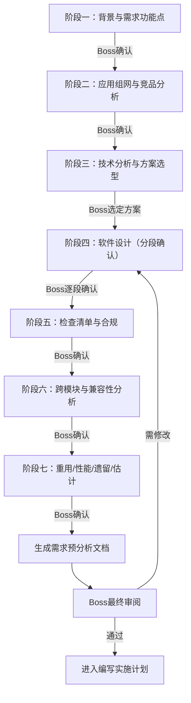

# 头脑风暴

通过结构化的协作对话，逐阶段收集需求信息，最终生成严格符合 `requirement-doc-template.md` 模板的**需求预分析文档**。所有图表使用 **Mermaid** 语法（Markdown 原生渲染，无需插件）。

## ⚠️ 铁律提醒

- 每次回复先称呼 **Boss**
- 不确定的设计决策**必须先问 Boss**
- **不写兼容性代码**，除非 Boss 主动要求

## 触发条件

在编写任何代码之前使用此规则。**每个**需求都必须经过此流程。"简单"需求恰恰是未审视假设导致最多浪费的地方。

## 最终输出

头脑风暴结束后，将所有收集到的信息按照 `requirement-doc-template.md` 模板生成需求预分析文档，保存到：

```
docs/plans/YYYY-MM-DD-<需求名称>-需求预分析.md
```

---

## 总体流程



---

## 第一阶段：背景与需求功能点

**对应文档章节**：`1 背景介绍`、`2.1 需求的详细描述`

### 需要收集的信息

1. **背景**：需求产生的原因？业务驱动？客户反馈？市场竞争？
2. **功能点列表**：拆解为一级功能 / 二级功能表格
3. **使用者**：谁会用？什么场景？
4. **优先级**：交付时间要求？

### 沟通方式

一次一个问题，优先选择题：

```
Boss，我先了解一下这个需求的背景。
请问驱动因素主要是？
A) 客户/市场明确提出
B) 竞品已有，需跟进
C) 内部技术演进/架构优化
D) 其他（请说明）
```

收集完背景后，与 Boss 共同梳理功能点列表：

```
Boss，基于您的描述，我梳理了以下功能点，请确认是否完整：

| 编号 | 一级功能 | 二级功能         |  备注  |
| ---- | :------: | :--------------- | :----: |
| 1    |  XXX     | xxx              |        |
| 2    |  XXX     | xxx              |        |

有没有遗漏的功能点？
```

**阶段结束条件**：Boss 确认功能点列表无遗漏。

---

## 第二阶段：应用组网与竞品分析

**对应文档章节**：`2.2 需求的应用和组网情况`、`2.3 竞争对手的相关信息`

### 需要收集的信息

1. **组网拓扑**：系统部署架构、网络拓扑、设备间关系
2. **竞品分析**：HK、DH 等友商是否有类似功能？实现方式？优劣对比
3. **专利风险**：是否涉及竞品专利？是否需要知会知识产权部？
4. **竞争优势**：弱于 / 持平 / 强于竞品？
5. **营销亮点**：提炼给市场的亮点

### 组网图使用 Mermaid 绘制

根据 Boss 描述的组网情况，用 `graph LR` 或 `graph TD` 绘制拓扑图，展示给 Boss 确认。

### Boss 不了解竞品时

记为"待补充"，不阻塞后续流程。

**阶段结束条件**：Boss 确认组网描述准确、竞品分析到位或标记"待补充"。

---

## 第三阶段：技术分析与方案选型

**对应文档章节**：`2.4 技术分析`（含工作量表）

### 需要收集的信息

1. **核心技术难点**：有哪些技术挑战？
2. **技术方案**：提出 **2-3 种方案**供 Boss 选择
3. **可行性评估**：每种方案的优劣势、风险、工期
4. **工作量预估**：业务分工、负责人、投入计划

### 方案对比展示

```
Boss，基于需求分析，有以下技术方案供选择：

**方案 A：[名称]**
- 思路：...
- 优势：...
- 劣势：...
- 预估工期：X 天

**方案 B：[名称]**
- 思路：...
- 优势：...
- 劣势：...
- 预估工期：X 天

我倾向推荐方案 A，因为...
Boss 选择哪个？
```

**阶段结束条件**：Boss 确定技术方案。

---

## 第四阶段：软件设计（分段确认）

**对应文档章节**：`2.5 软件设计`（2.5.1 ~ 2.5.8 全部子章节）

这是最核心的阶段。**必须分段展示，每段确认后再进入下一段。**

### 4.1 接口设计（→ 2.5.1）

收集并展示：
- 新增/变更的接口清单（方法、路径、说明）
- 每个接口的请求/响应格式

展示后询问 Boss 确认。

### 4.2 界面设计（→ 2.5.2）

收集并展示：
- 界面原型描述（交互逻辑、控件布局）
- 用 Mermaid `graph TD` 绘制**页面流转图**

展示后询问 Boss 确认。

### 4.3 关键业务流程（→ 2.5.3）

收集并展示（使用 Mermaid 绘制）：
- **时序图**（`sequenceDiagram`）：消息交互流程
- **状态机**（`stateDiagram-v2`）：状态变迁（如涉及）
- **流程图**（`flowchart TD`）：业务逻辑判断

展示后询问 Boss 确认。

### 4.4 数据库设计（→ 2.5.4）

收集并展示：
- 新增表结构（字段、类型、约束、默认值）
- 新增字段（在现有表上的变更）
- 用 Mermaid `erDiagram` 绘制 **ER 图**
- 关注数据清理、分库分表、连接数、存储空间

展示后询问 Boss 确认。

### 4.5 可维护性设计（→ 2.5.5）

收集：日志方案、DT 工具、Prometheus 指标。

日志方案必须明确：

1. 旧项目是否沿用既有日志结构（框架、字段、级别、traceId）
2. 新项目日志框架选型与结构化字段规范
3. 日志语言约束（English only）
4. 控制台输出策略（默认禁止，除非 Boss 明确要求）

### 4.6 高可靠性设计（→ 2.5.6）

收集：是否支持双机、集群、无感升级。

### 4.7 产品化（→ 2.5.7）

收集：配置文件、安装/启动脚本、进程守护。

### 4.8 全局配置开关（→ 2.5.8）

收集：新增/变更的全局开关。

**阶段结束条件**：Boss 逐段确认 2.5.1 ~ 2.5.8 所有内容。

---

## 第五阶段：检查清单与合规

**对应文档章节**：`2.6 检查清单`（2.6.1 ~ 2.6.6 全部子章节）

### 逐项向 Boss 确认

```
Boss，以下是安全合规检查项，请逐项确认：

1. 对外接口是否有异常保护和鉴权？
2. 是否新增TCP/UDP端口？
3. 强密码和加密传输是否到位？
4. 敏感信息是否加密保存？
5. 是否有Web安全风险（XSS/CSRF/注入）？
6. 是否新增收集个人信息？隐私政策是否更新？
```

### 其他检查子项

- **2.6.2 产品开发合规**：法规要求、敏感词
- **2.6.3 对接配套**：多部件产品配套评估
- **2.6.4 开源库变更**：新增/修改的开源库（协议、版本、下载地址）
- **2.6.5 对其他组件影响**：受影响组件及应对方案
- **2.6.6 其他**：部门自定义检查项

**阶段结束条件**：Boss 确认所有检查项。

---

## 第六阶段：跨模块与兼容性分析

**对应文档章节**：`2.7 跨模块问题分析`（2.7.1 ~ 2.7.4 全部子章节）

### 需要收集的信息

**2.7.1 交付件影响评估**：
- 系列产品影响（配置、内存、界面差异、性能、启动时间）
- 是否支持/影响跨域
- 终端产品影响（IPC、NVR、AIBOX 等，关注 flash/内存/前向兼容）
- 平台关键资源（内存、版本空间、数据库空间、Socket/FD、存储留存期）
- 白牌 & 定制版本影响（中性化/资源化处理）

**2.7.2 版本兼容性分析**：
- OPENAPI、SDK、终端设备、域间接口的兼容性

**2.7.3 版本平滑升级**：
- 升级方案，重点描述数据库表变更
- 用 Mermaid `graph TD` 绘制升级流程图

**2.7.4 特性依赖性**：
- 对其他特性的依赖、新增外部库依赖

**Boss 不确定的项目标记"待评估"，提醒后续补充。**

**阶段结束条件**：Boss 确认跨模块分析完整。

---

## 第七阶段：收尾评估

**对应文档章节**：`2.8 重用分析`、`2.9 性能目标`、`2.10 遗留缺陷`、`2.11 估计`

### 需要收集的信息

1. **重用分析**（2.8）：其他版本/开源代码是否已实现？可移植性？知识产权？可复用组件？
2. **性能目标**（2.9）：关键性能指标及目标值
3. **遗留缺陷**（2.10）：预估遗留问题（升级、组网、应用角度）
4. **估计**（2.11）：代码规模、难度、周边影响、人力、测试工作量、风险

**阶段结束条件**：Boss 确认所有评估信息。

---

## 文档生成

所有阶段完成后：

1. **严格按照** `requirement-doc-template.md` 模板生成完整文档
2. 所有图表使用 **Mermaid** 语法（`graph`、`sequenceDiagram`、`stateDiagram-v2`、`flowchart`、`erDiagram`）
3. Boss 未确认或标记为"待补充"的章节保留标题，内容标注 `<!-- TODO: 待补充 -->`
4. 模板中的*斜体说明文字*保留在文档中作为填写指引
5. 保存到 `docs/plans/YYYY-MM-DD-<需求名称>-需求预分析.md`
6. 提交到版本控制（Git 或 SVN）
7. 向 Boss 展示完整文档，获得最终确认

**终止状态**：Boss 审阅通过，进入**编写实施计划**阶段。

---

## 关键原则

- **一次一个问题** — 不要用多个问题淹没 Boss
- **优先使用选择题** — 比开放式问题更容易回答
- **分段展示** — 每段 200-300 字以内，确认后再继续
- **严格执行 YAGNI** — 从所有设计中移除不必要的功能
- **探索替代方案** — 技术方案阶段始终提出 2-3 种方案
- **不确定就问** — 任何拿不准的技术决策必须询问 Boss
- **图表用 Mermaid** — 不使用任何需要插件的图表工具

## 禁止事项

- 不要调用任何实现相关的技能或工具
- 不要编写任何业务代码、搭建任何项目
- 不要跳过任何阶段（即使 Boss 说"简单做做就行"）
- 不要在文档中使用非 Mermaid 的图表
- 头脑风暴之后唯一的下一步是**编写实施计划**
