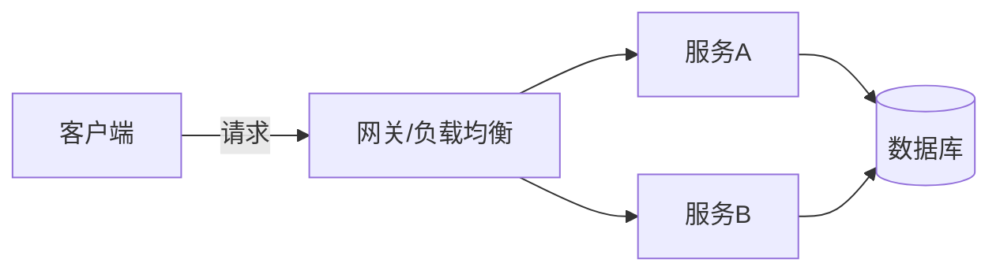
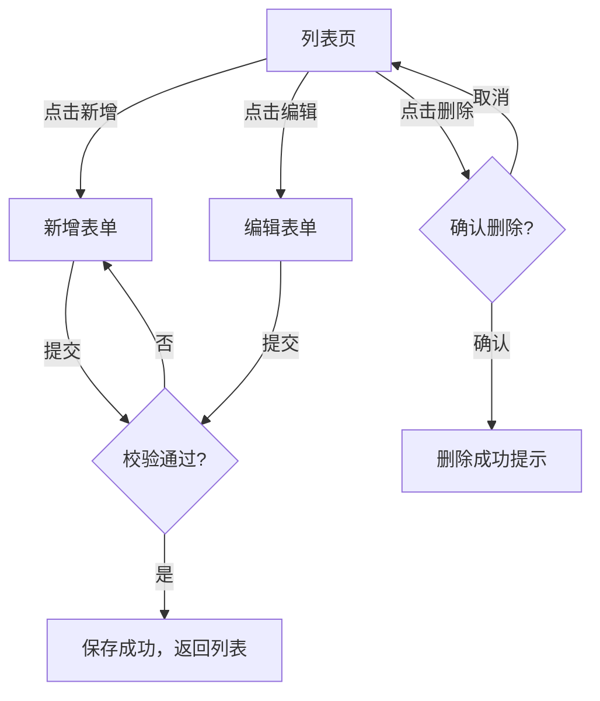
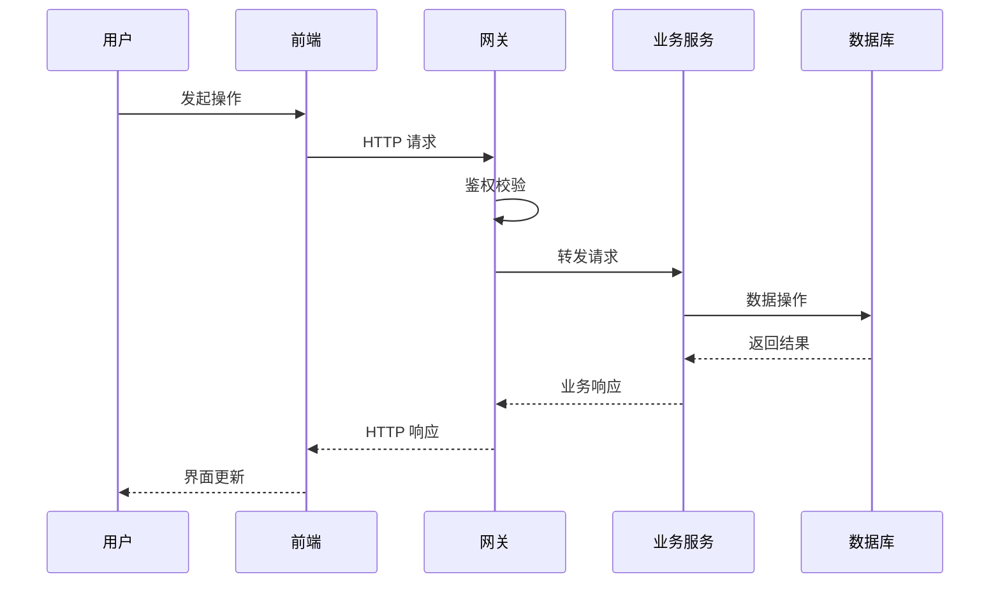
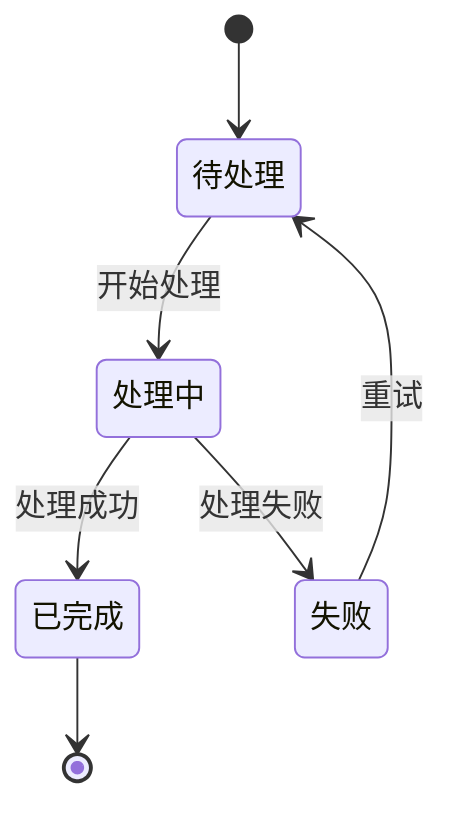
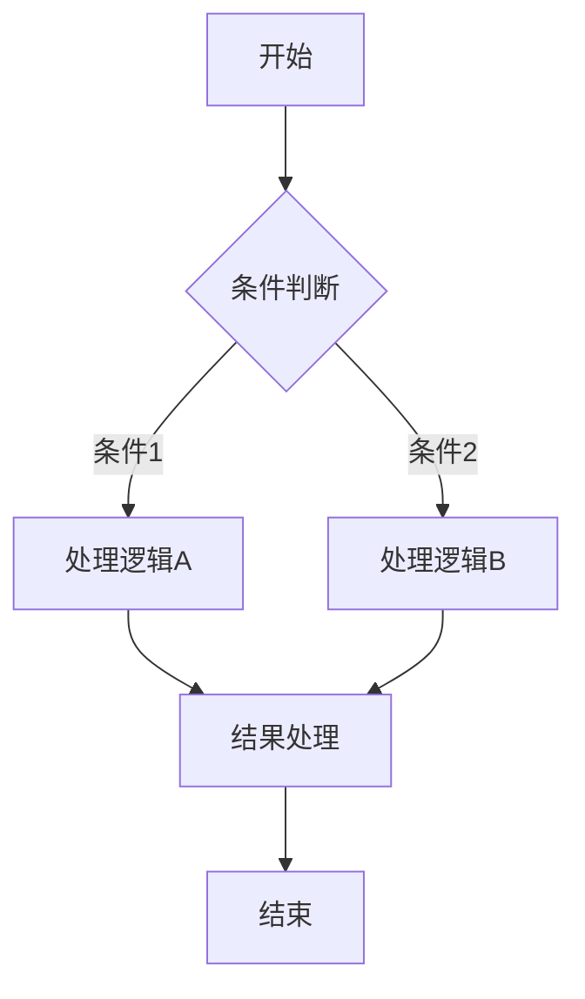
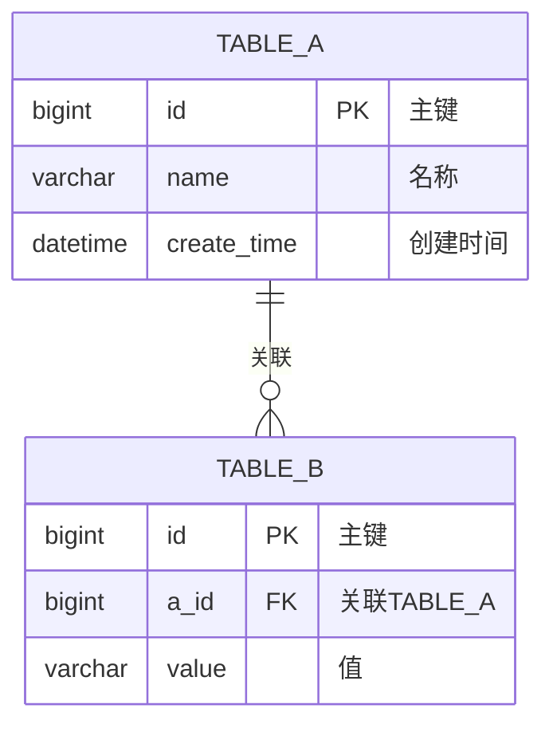
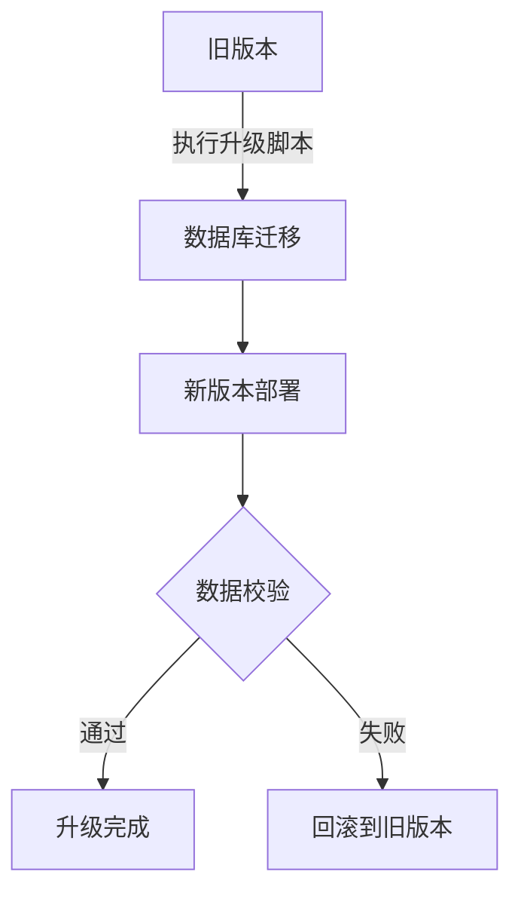

# 需求预分析文档模板

头脑风暴阶段最终输出文档**必须**严格遵循此模板结构。所有图表使用 **Mermaid** 语法（Markdown 原生渲染，无需任何插件）。

## 文档保存路径

```
docs/plans/YYYY-MM-DD-<需求名称>-需求预分析.md
```

---

## 完整模板

以下是完整的文档模板。头脑风暴过程中收集到的信息必须按此结构填入对应章节。未收集到的信息保留章节标题并标注 `<!-- TODO: 待补充 -->`。

````markdown
# xxxx需求预分析

[TOC]

## 1 背景介绍

[描述需求产生的背景、业务场景、驱动因素]

## 2 需求分析

### 2.1 需求的详细描述

*需求功能点列表*

| 编号 | 一级功能 | 二级功能         |             备注             |
| ---- | :------: | :--------------- | :--------------------------: |
| 1    |          |                  |                              |

### 2.2 需求的应用和组网情况

[描述需求的典型应用场景和组网拓扑]

<!-- 使用 Mermaid 绘制组网拓扑图 -->


### 2.3 竞争对手的相关信息

*关于友商是否有类似功能，及其实现细节；分析友商的实现优劣之处，重点对比HK、DH等产品的实现，必选。
如果是"不涉及"、"无相关信息"，也需要说明。如果涉及专利风险，需要进行详细分析，实现方案需要考虑绕过竞争对手专利，如果不能绕过竞争对手专利，需提前知会知识产权部。
实现本需求后，相比竞争对手的竞争优势，包括是弱于竞争对手，和竞争对手持平还是强于竞争对手。提炼出给市场的营销亮点。*

| 对比维度 | 本产品方案 | HK | DH | 其他竞品 |
| -------- | ---------- | -- | -- | -------- |
| 功能完整性 | | | | |
| 易用性 | | | | |
| 性能 | | | | |
| 扩展性 | | | | |

**竞争优势分析**：[与竞品对比的结论]
**营销亮点**：[提炼给市场的营销亮点]
**专利风险**：[是否涉及专利风险，如涉及需详细分析]

### 2.4 技术分析

[核心技术难点分析、可行性评估、技术方案选型]

#### 工作量

| 业务         | 负责人 | 投入计划  | 工作量 |
| ------------ | ------ | --------- | ------ |
|              |        |           |        |

### 2.5 软件设计

#### 2.5.1 接口设计

*包括SDK接口、LAPI/OpenAPI接口、MQ消息接口等，必选。*

**接口列表**

| 接口名称 | 方法 | 路径 | 说明 |
| -------- | ---- | ---- | ---- |
|          |      |      |      |

**接口详情**

```
POST /api/v1/xxx
请求体：
{
    "field1": "string",
    "field2": 0
}
响应体：
{
    "code": 0,
    "msg": "success",
    "data": {}
}
```

#### 2.5.2 界面设计

*界面原型设计，如果特性有新增界面且无类似界面可参考或对原界面布局作较大改动，必选。*
*界面原型设计需考虑易用性（参考易用性设计checklist）。有相似功能或控件等，建议继续原有设计方式。*

<!-- 使用 Mermaid 绘制页面流转图 -->


#### 2.5.3 关键业务流程

*详述业务流程，包含业务逻辑图、流程图、后台存储流程图、消息流程设计、状态机设计等，必选。*

**主业务流程（时序图）**



**状态机设计**（如涉及状态变更）



**业务逻辑流程图**



#### 2.5.4 数据库设计

*包括数据库表结构、初始值、ER图等，对于使用数据库或Redis的软件，必选。*
*新增数据库表时需要关注数据清理、分库分表、连接数、存储空间等相关基本技术点。*

##### 2.5.4.1 数据库新增表

*包括库表结构、初始值等。*

| 字段名 | 类型 | 是否为空 | 默认值 | 说明 |
| ------ | ---- | -------- | ------ | ---- |
| id     | bigint | NOT NULL | 自增   | 主键 |
|        |      |          |        |      |

##### 2.5.4.2 数据库新增字段

*在现有表中新增的字段，包括库表结构、初始值等。*

| 所属表 | 字段名 | 类型 | 是否为空 | 默认值 | 说明 |
| ------ | ------ | ---- | -------- | ------ | ---- |
|        |        |      |          |        |      |

##### 2.5.4.3 ER图

*描述数据库的ER图设计。*



#### 2.5.5 可维护性设计

*包括日志、DT工具、Prometheus可收集的信息等。*

| 类型 | 内容 | 说明 |
| ---- | ---- | ---- |
| 日志框架/封装 |      | 旧项目沿用；新项目需选型 |
| 日志字段规范 |      | 例如 traceId/module/action/result/errorCode/durationMs |
| 日志语言约束 | English only | 禁止中文日志 |
| 控制台输出策略 | 默认禁止 | 仅在明确要求时允许 |
| DT工具 |      |      |
| Prometheus指标 |      |      |

#### 2.5.6 高可靠性设计

*评估本特性是否支持双机、集群、无感升级等，如果需要支持，在设计和验证方面做好充分考虑。*

| 高可靠场景 | 是否支持 | 设计方案 |
| ---------- | -------- | -------- |
| 双机热备   | 是/否    |          |
| 集群部署   | 是/否    |          |
| 无感升级   | 是/否    |          |

#### 2.5.7 产品化

*包括组件配置文件、安装和启动脚本等。*
*新增进程需要关注进程守护、日志压缩、备份和清理等相关基本技术点。*

#### 2.5.8 全局配置开关

*全局开关表明某些功能是有一些使用范围的限制的。典型的开关如：
全局推送的开关；推送编码直接为本系统编码的开关等；这些全局开关目前都放置在各个组的配置文件中。如有修改或新增，请在此说明和评估必要性。*

| 开关名称 | 配置位置 | 默认值 | 说明 |
| -------- | -------- | ------ | ---- |
|          |          |        |      |

### 2.6 检查清单

#### 2.6.1 安全合规设计

*1、对外接口是否有增加异常保护，是否有未鉴权等安全风险。
2、是否新增监听TCP/UDP端口、端口和业务接口鉴权安全机制、强密码、敏感信息加密传输和保存、Web应用安全、日志和配置安全。
3、是否新增收集个人信息及隐私政策是否需要更新。
如果涉及到，需进行详细说明。*

| 检查项 | 结果 | 说明 |
| ------ | ---- | ---- |
| 对外接口异常保护和鉴权 | 是/否 | |
| 新增TCP/UDP端口 | 是/否 | |
| 强密码和加密传输 | 是/否 | |
| 敏感信息加密保存 | 是/否 | |
| Web应用安全（XSS/CSRF/注入） | 是/否 | |
| 新增收集个人信息 | 是/否 | |
| 隐私政策是否需要更新 | 是/否 | |

#### 2.6.2 产品开发合规指南

*包括产品开发合规相关的法规要求，以及研发科技伦理术语表（即敏感词）。*

#### 2.6.3 对接配套

*评估本特性是否满足设备对接配套流程，涉及多部件产品配套时必选，
涉及多部件产品配套的公共模块对接接口变更时，开发需提交给SE，由SE提交议题到系统部，变更修改方案经系统部拉通各部门SE评估修改影响，各部门SE同意后再交由开发修改实施。
修改方案及评估结论（见下表）需要写入需求预分析文档中。
涉及多部件产品配套的公共模块对接接口包括但不限于：SDK接口、LAPI/OpenAPI接口、MQ消息接口等。
涉及多部件产品配套的公共模块对接接口变更时，开发需起特性修改。
开发修改后，需要对涉及的产品款型（由各部门SE在方案评估时提供）进行遍历验证，并提交测试中心验收。*

评估结论汇总表：

| 部门 | 评估人 | 推荐配套款型 | 备注 |
| ---- | ------ | ------------ | ---- |
|      |        |              |      |

#### 2.6.4 开源库变更

*开源库的新增、修改以及版本变更，需要列出开源协议、版本、下载地址，功能说明。*

| 库名称 | 版本 | 开源协议 | 下载地址 | 功能说明 |
| ------ | ---- | -------- | -------- | -------- |
|        |      |          |          |          |

#### 2.6.5 对其他组件的影响

| 受影响的组件 | 影响评估 | 应对方案 |
| ------------ | -------- | -------- |
|              |          |          |

#### 2.6.6 其他

*各部门按需定义自己部门内的流程检查项*

| 检查点                                       | 检查结果 | 备注 |
| -------------------------------------------- | -------- | ---- |
| *涉及周边组件的配套版本是否明确*             | *是/否*  |      |
| *是否需要申请新的端口*                       | *是/否*  |      |
| *是否涉及产品化或数据库的修改*               | *是/否*  |      |
| *是否支持升级*                               | *是/否*  |      |
| *是否涉及一些常见问题，需要单独考虑运维优化* | *是/否*  |      |
| *是否用到了新的开源组件*                     | *是/否*  |      |

### 2.7 跨模块问题分析

*对涉及跨组件或跨模块设计的需求进行详细的描述和技术风险分析。*

#### 2.7.1 交付件影响评估

##### 2.7.1.1 系列产品的影响

*评估本特性对系列交付件的影响，重点关注配置文件、内存、界面的差异、性能差异、启动时间等。*

##### 2.7.1.2 是否支持跨域

*是否支持跨域，或影响跨域功能。*

##### 2.7.1.3 终端产品的影响

*评估本特性对系列终端交付件（IPC、NVR、AIBOX、显控产品、EIA等）的影响，重点关注flash空间大小、内存大小、与终端版本的前向兼容性，以及在研终端的影响。
尤其是要关注IPC，如果IPC需要支持这些特性，需要提前知会到IPC产品。*

##### 2.7.1.4 平台关键资源的影响

*评估本特性对如基本业务模型下内存占用、版本空间大小的增加、数据库空间增长、socket/fd数量增加、存储留存期等的影响，如影响到系统的业务开展或后续扩展，需要对总体设计进行重新设计考虑。*

| 资源类型 | 当前占用 | 预计增量 | 影响评估 |
| -------- | -------- | -------- | -------- |
| 内存     |          |          |          |
| 版本空间 |          |          |          |
| 数据库空间 |        |          |          |
| Socket/FD |         |          |          |
| 存储留存期 |        |          |          |

##### 2.7.1.5 白牌&定制版本的影响

*评估本特性是否体现公司信息：例如LOGO、我司特有的名称、产品型号、产品名称、产品描述、资料、数字证书、版本号、进程名称、报文字段等可以中性的需要中性处理，无法中性的需要做资源化处理，必选。*

#### 2.7.2 版本兼容性分析

| 组件       | 兼容性要求                                                   | 评估结果 |
| ---------- | ------------------------------------------------------------ | -------- |
| *OPENAPI*  | *评估OPENAPI接口的前向兼容性*                                |          |
| *SDK*      | *合入新特性的产品版本可兼容已发布或历史版本SDK接口（网络SDK、解码库SDK）* |          |
| *终端设备* | *合入新特性的平台版本可兼容终端设备的历史版本*               |          |
| *域间接口* | *合入新特性的平台版本可与历史平台版本、第三方平台实现互通*   |          |
| *其他*     |                                                              |          |

#### 2.7.3 版本平滑升级

*如何实现版本的平滑升级，描述版本涉及到的版本，重点是数据库的表设计变更。*

<!-- 使用 Mermaid 绘制升级流程图 -->


#### 2.7.4 特性的依赖性

*如果存在对其它特性的依赖，影响合入版本，需要在此明确；
新增依赖其他项目组/部门的库，例如新增算法库等。*

### 2.8 重用分析

*其他版本或开源代码实现情况介绍。例如其他版本或开源代码是否已经实现，是否可移植，是否需要重新设计，是否满足知识产权要求等；
还需分析可使用本组织内的哪些重用组件、可以提供哪些重用组件。*

### 2.9 性能目标

*明确此特性功能的性能规格，防止项目中超规格使用带来问题。*

| 性能指标 | 目标值 | 测试方法 |
| -------- | ------ | -------- |
|          |        |          |

### 2.10 遗留缺陷

*此特性开发完成后，是否遗留了当前无法解决的缺陷，可从升级、组网、应用等角度进行缺陷的评估。遗留的问题需要开发代表、设计负责人、测试负责人确认。*

| 缺陷描述 | 影响范围 | 临时方案 | 计划解决版本 |
| -------- | -------- | -------- | ------------ |
|          |          |          |              |

### 2.11 估计

*代码规模*

| 分配需求 | 代码量 | 备注 |
| -------- | ------ | ---- |
|          |        |      |

*难度与复杂程度：*
*周边模块影响度：*
*人力投入：*
*测试工作量：*
*风险：*
````

---

## Mermaid 图表速查

头脑风暴过程中根据需要选用以下图表类型，全部为 Markdown 原生支持，无需任何插件：

| 场景 | Mermaid 类型 | 语法关键词 | 适用章节 |
|---|---|---|---|
| 组网拓扑 / 模块关系 | 流程图 | `graph LR` 或 `graph TD` | 2.2 组网情况 |
| 业务交互 / 消息流程 | 时序图 | `sequenceDiagram` | 2.5.3 关键业务流程 |
| 状态变迁 | 状态图 | `stateDiagram-v2` | 2.5.3 状态机设计 |
| 业务逻辑判断 | 流程图 | `flowchart TD` | 2.5.3 业务逻辑图 |
| 数据库关系 | ER 图 | `erDiagram` | 2.5.4.3 ER图 |
| 版本升级流程 | 流程图 | `graph TD` | 2.7.3 平滑升级 |
| 类关系 / 模块依赖 | 类图 | `classDiagram` | 2.5 软件设计（按需） |
| 项目排期 | 甘特图 | `gantt` | 2.4 工作量（按需） |
