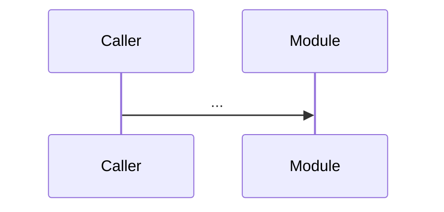

# 历史实现规格（Historical Spec）

> 用途：在做任何扩展前，先把"原实现已经做了什么"反向沉淀成 spec，强制 AI 真正理解项目。
> 文件位置：`docs/specs/YYYY-MM-DD-<模块名>-historical-spec.md`
> 信息来源优先级：三层文档（CONTEXT.md + 头部 INPUT/OUTPUT/POS）→ GitNexus（先做基线对比）→ 手动阅读
> 完成后必须提交 Boss 核实，未确认前禁止进入头脑风暴或扩展需求分析。

---

## 1. 元信息

- 模块/功能名称：
- 调研范围（路径 / 模块）：
- 信息来源声明：
  - 三层文档覆盖率：N/M 个目录有 `CONTEXT.md`，K/L 个文件含三行注释
  - GitNexus 状态：可用 / 不可用；基线 commit `<sha>`；本次差异 `riskLevel=`
  - 手动阅读补充：列出降级原因和实际全量阅读的文件清单
- 调研时基准 commit：`<sha>`

## 2. 业务目标（反向推断）

- 这块代码是为了解决什么业务问题？
- 服务于哪些角色 / 调用方？
- 当前线上承载的核心场景：

## 3. 用例清单（穷举，禁止抽样）

| 用例编号 | 触发入口 | 主路径 | 异常路径 | 当前实现位置 |
|---|---|---|---|---|
| UC-01 | | | | `path/to/file.go:line` |

## 4. 对外接口契约

| 接口 | 协议 | 入参 | 出参 | 错误码 | 调用方 |
|---|---|---|---|---|---|
| | HTTP/RPC/CLI/事件 | | | | |

## 5. 数据模型

- 关键数据对象（实体 / VO / DTO）：
- 持久化结构（表 / 集合 / 文件）：
- 数据生命周期与一致性约束：

## 6. 关键流程（Mermaid）

## 7. 跨模块依赖

| 依赖目标 | 类型 | 强弱 | 失败影响 |
|---|---|---|---|
| | 同步调用 / 事件 / 共享存储 | 强 / 弱 | |

## 8. 隐含约束（来自代码 / 注释 / 测试反推）

- 必须保持的不变量：
- 不可破坏的副作用顺序：
- 性能 / 资源 SLA：
- 鉴权与权限边界：

## 9. 当前缺陷与技术债务

- 已知 bug（含工单链接）：
- 临时补丁 / TODO：
- 设计妥协（被迫做的事）：

## 10. 日志与观测约束

- 日志框架与字段结构：
- traceId / requestId 传递方式：
- 现有指标 / 告警规则：
- 控制台输出策略（应禁止 / 允许范围）：

## 11. 测试覆盖与回归集

- 现有测试入口：
- 主路径覆盖：
- 边界 / 异常覆盖：
- **回归保命集**（任何扩展不得让这些用例失败）：

## 12. 风险地图（扩展时必须警惕）

- 共享契约位置：
- 高耦合 / 高变更频率热区：
- 历史踩坑沉淀：

## 13. Boss 核实清单（必须打勾）

- [ ] 业务目标与原实现意图一致
- [ ] 用例清单无遗漏
- [ ] 接口契约准确
- [ ] 数据模型无误读
- [ ] 隐含约束已覆盖
- [ ] 回归保命集已确认
- [ ] 信息来源声明属实（三层文档 / GitNexus / 手动）

> 任何一项未打勾 → 返回 BLOCKED，回到对应章节补全后再次提交核实。
