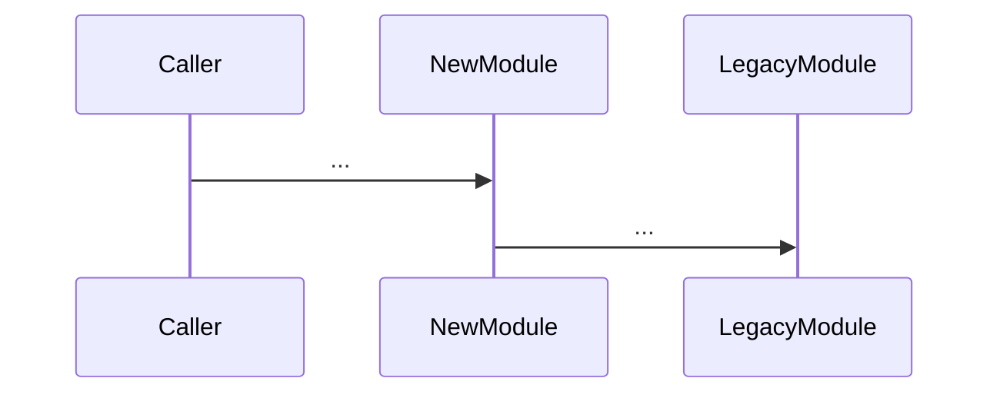

# 扩展需求分析规格（Requirement Analysis Spec）

> 用途：在历史实现规格已确认后，结合扩展需求做头脑风暴，输出完整、可追溯的需求分析规格。
> 文件位置：`docs/specs/YYYY-MM-DD-<需求名称>-requirement-analysis.md`
> 前置条件：`historical-spec.md` 已生成且 Boss 核实通过
> 完成后必须提交 Boss 核实，未确认前禁止进入 `/write-plan` 或实现阶段。

---

## 1. 元信息

- 需求名称：
- 需求来源（工单 / 邮件 / 会议）：
- 关联历史规格：`docs/specs/<...>-historical-spec.md`
- 关联头脑风暴文档：`docs/plans/<...>-需求预分析.md`
- 优先级 / 期望交付时间：
- 复杂度判断（L/M/H）及理由：

## 2. 业务目标与成功标准

- 必须解决的问题（**不是要做什么功能，而是要解决什么问题**）：
- 成功标准（可度量）：
- 非目标（明确不做的事，避免范围蔓延）：

## 3. 与历史规格的关系（四类决策）

> 必须从 `historical-spec.md` 中逐条引用受影响项，给出复用 / 扩展 / 替换 / 废弃判断。

| 历史项 | 历史规格章节 | 决策 | 理由 | 影响范围 |
|---|---|---|---|---|
| UC-01 用户登录 | §3 | 复用 | | |
| 接口 GET /v1/users | §4 | 扩展（新增可选字段） | | |
| 表 t_user.role 字段 | §5 | 替换（拆出 user_role 表） | | |
| 临时补丁 X | §9 | 废弃 | | |

## 4. 用例增量

| 用例编号 | 触发入口 | 主路径 | 异常路径 | 验收标准 |
|---|---|---|---|---|
| UC-NEW-01 | | | | |

## 5. 接口与数据增量

- 新增接口：
- 修改接口（含兼容性影响）：
- 新增数据对象 / 表 / 字段：
- 数据迁移方案：

## 6. 关键流程（Mermaid）

## 7. 跨模块影响与共享契约变更

- 受影响模块清单（与 historical-spec §7 对齐）：
- 共享契约变更点：
- 反向依赖检查（旧模块是否会回调新模块）：

## 8. 非功能需求

- 性能：
- 安全 / 鉴权 / 隐私：
- 可观测：
- 可靠性 / 故障域：
- 兼容性策略（**默认不写兼容代码，除非 Boss 明确要求**）：

## 9. 风险与缓解

| 风险 | 概率 | 影响 | 缓解措施 | 触发回滚条件 |
|---|---|---|---|---|
| | | | | |

## 10. 验收标准（系统/业务级）

- 业务侧验收：
- 技术侧验收：
- 回归集（必须保留 historical-spec §11 的全部用例 + 新增用例）：

## 11. 需求 → 设计 → 实现 → 验证追溯矩阵（强制）

> 实现 spec 与代码必须 100% 覆盖本表的"需求"列；缺一即视为不完整交付。

| 需求项 ID | 需求描述 | 设计章节 | 实现位置（计划） | 验证用例 ID | 状态 |
|---|---|---|---|---|---|
| REQ-01 | | spec §x.y | `path/to/file:func` | TC-01 | pending |
| REQ-02 | | spec §x.y | `path/to/file:func` | TC-02 | pending |

## 12. Boss 核实清单（必须打勾）

- [ ] 业务目标与成功标准已确认
- [ ] 与历史规格的四类决策已确认
- [ ] 用例增量无遗漏
- [ ] 接口/数据/迁移方案已确认
- [ ] 共享契约变更已确认或显式标记不变更
- [ ] 非功能需求已确认（含日志、兼容性策略）
- [ ] 风险与回滚条件已确认
- [ ] 验收标准与回归集已确认
- [ ] 追溯矩阵每行可被独立验收

> 任何一项未打勾 → 返回 BLOCKED，禁止进入 `/write-plan`。
