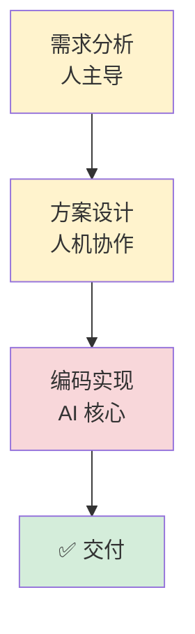

# Mermaid 绘图规范

核心流程 / 架构文档中使用 Mermaid 时遵循：

## 1. 图表类型选择

| 用途 | 语法 |
|---|---|
| 流程图（模块内部逻辑、决策分支）| `flowchart` |
| 时序图（跨模块交互顺序）| `sequenceDiagram` |
| 架构图 | `graph` 或 `flowchart` |
| ER 图（表关系）| `erDiagram` |

时序图适合跨模块交互，流程图适合模块内部逻辑——复杂场景可双图互补。

## 2. 配色方案

| 环节 | 颜色 |
|---|---|
| 人主导 | `#fff3cd`（黄）|
| AI 核心 | `#f8d7da`（红）|
| 自动化 | `#d6d8db`（灰）|
| 完成状态 | `#d4edda`（绿）|

## 3. 连线样式

节点间连线统一使用**折线**样式，不使用曲线。

## 4. 一图一事

- 一张图只讲一件事，5-8 个节点
- 宁可多张简单图，不要一张复杂图
- 每张图配简短标题，图后用 2-3 句话补充关键信息

## 5. 可渲染自检

- 语法正确：括号匹配、箭头方向、节点 id 无特殊字符
- 角色名/标签无会破坏解析的特殊字符
- 中文标签用引号包裹避免解析歧义

## 示例

