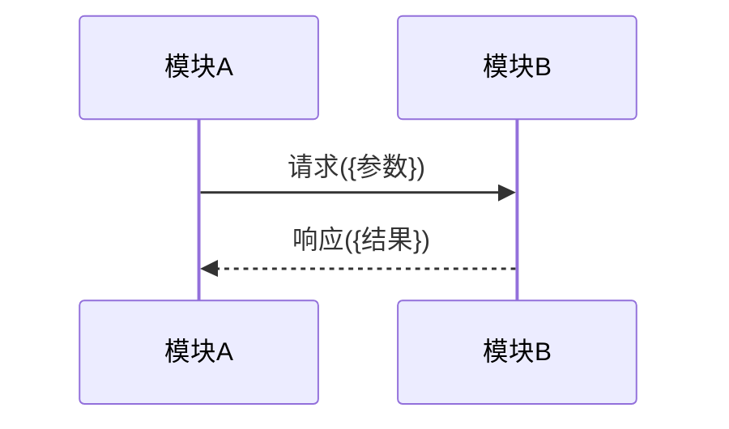
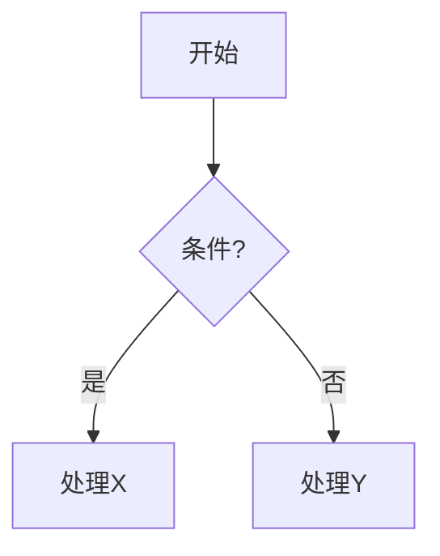

# {业务名称}流程

> 核心流程文档。放 `spec/{子组件}/核心流程/{业务名称}流程.md`。命名格式：`{业务名称}流程.md`。

## 概述

一段话：这个流程干什么、从哪触发、到哪结束、涉及哪些模块。

## 时序图（跨模块交互）

## 流程图（决策分支）

> 时序图关注多方交互顺序，流程图关注决策分支，互补完整。配色/连线见 `mermaid-conventions.md`。

## 流程步骤

| 步骤 | 执行者 | 操作 | 输入 | 输出 |
|---|---|---|---|---|
| 1 | {模块} | {操作} | {输入} | {输出} |

## 异常分级

| 等级 | 范围 | 处理策略 |
|---|---|---|
| L1 | 单条/单元级 | {策略} |
| L2 | 批量级 | {策略} |
| L3 | 系统/SDK 级 | {策略} |

## 接口规格（如需）

> 可嵌入接口定义（如 Go struct / 函数签名），实现设计到代码的无缝衔接。锁接口契约，不锁内部实现。

## 注意事项

- {如「向量检索需遍历引擎聚合结果；按 ID 查询是定点查询」}
