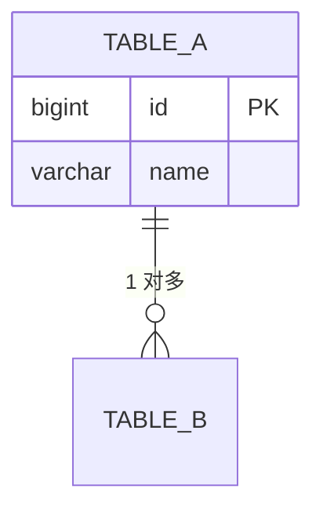

# {子组件名称} 数据库设计

> 描述数据存储结构。放 `spec/{子组件}/数据库设计.md`。

## ER 图



## 表清单

| 表名 | 用途 | 保留策略 |
|---|---|---|
| {表名} | {用途} | {7天 / 30天 / 永久} |

## 表结构（DDL + 说明 + 示例 三位一体）

### {表名}

```sql
CREATE TABLE {表名} (
  id BIGINT PRIMARY KEY COMMENT '主键',
  name VARCHAR(128) NOT NULL COMMENT '名称',
  created_at TIMESTAMP DEFAULT CURRENT_TIMESTAMP COMMENT '创建时间',
  INDEX idx_name (name)
) COMMENT '{表用途}';
```

| 字段 | 类型 | 说明 | 示例值 |
|---|---|---|---|
| id | BIGINT | 主键 | 1001 |
| name | VARCHAR(128) | 名称 | "order-export" |

## 数据生命周期

| 表 | 保留时长 | 分区策略 | 清理方式 |
|---|---|---|---|
| {表} | {时长} | {策略} | {清理 SQL / 定时任务} |
