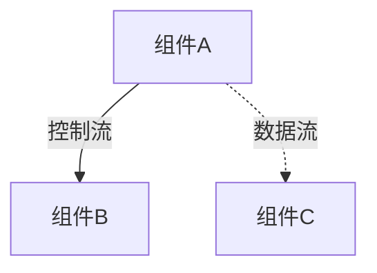

# {子系统名称}

> 子系统级 README（高层 Spec，面向人，指导架构方向）。系统级顶层设计独立仓库维护。

## 概述

一段话说清楚：这个子系统干什么、为什么存在、解决什么问题。读者读完应能判断「这个子系统和我关注的问题是否相关」。

## 功能清单

| 功能 | 说明 | 实现状态 |
|---|---|---|
| {功能} | {做什么 / 有什么用} | ✅ 本期实现 / 🚧 开发中 / 🚧 设计完成 / 📋 规划中 |

## 架构图

用实线/虚线区分控制流/数据流。配色见 `mermaid-conventions.md`。

## 组件划分

| 组件 | 职责 | 对应代码仓库 |
|---|---|---|
| {组件} | {职责边界} | {仓库} |

## 核心机制

{展开关键机制（如快照/缓存/并发策略）的细节：存储格式、恢复流程、配置参数、已知问题}

## 文档索引

- 各组件设计：{相对路径链接}
- 跨组件交互流程：{链接}
