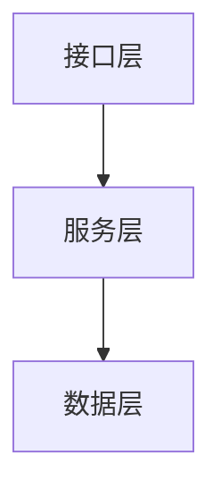

# {子组件名称}

> 子组件级 README。一个子组件对应一个代码仓库，本文件放仓库 `spec/{子组件名}/README.md`。

## 概述

一段话：这个子组件干什么、为什么存在、解决什么问题。

## 功能清单

| 模块 | 功能点 | 描述 | 依赖 | 实现状态 |
|---|---|---|---|---|
| {模块} | {功能点} | {做什么 / 有什么用} | {依赖} | ✅/🚧/📋 |

## 架构图

## 模块划分

| 模块 | 负责 | 不负责 |
|---|---|---|
| {模块A} | {做什么} | {不做什么，防边界模糊} |

## 文档索引

- 技术选型：`./技术选型.md`
- 接口契约：`./openapi.yaml`
- 数据库设计：`./数据库设计.md`
- 核心流程：`./核心流程/{业务名称}流程.md`
- 子模块：`./子模块/{子模块名}/README.md`

## 设计与实现差异

> 实现偏离 Spec 时在此显式标注（诚实性），而非删除或隐瞒。
