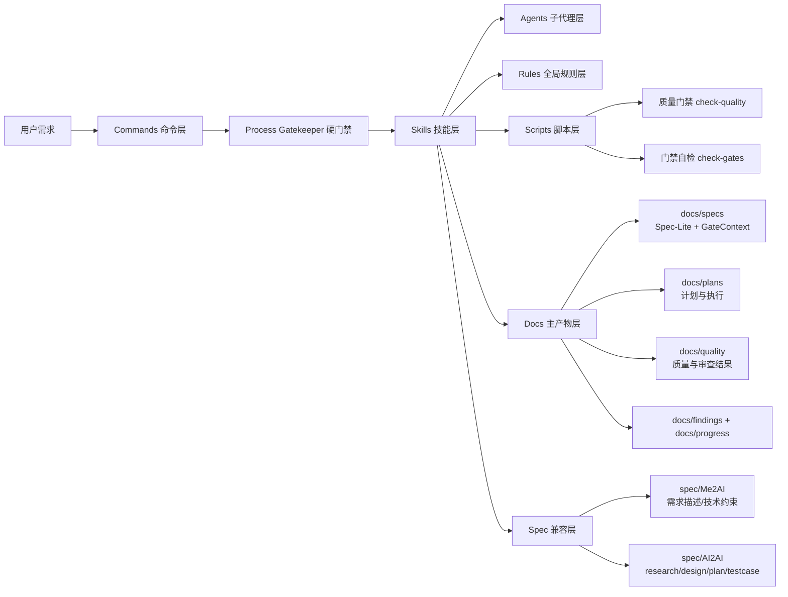

# Superpowers → CodeBuddy 转换项目

本项目将 [obra/superpowers](https://github.com/obra/superpowers) 的核心功能转换为腾讯 CodeBuddy（IDE 和 CLI）可直接使用的格式，所有文档内容均为中文。

## 相比原版 Superpowers 的增强

| 增强项 | 说明 |
|---|---|
| 🔀 **双版本控制支持** | 同时支持 Git 和 SVN，自动检测项目使用的 VCS |
| 🧩 **`/extend` 扩展命令** | 全新的项目功能扩展工作流，理解现有代码后安全新增功能 |
| 🔒 **三条铁律** | 称呼规则、决策确认、禁止兼容性代码——贯穿所有规则和代理 |
| 🕵️ **项目分析代理** | 新增 `project-analyzer` 子代理，深度分析已有项目结构 |
| 📖 **三层代码自文档体系** | 源码头部注释 + 模块 CONTEXT.md + 自动级联更新，AI 秒懂任意模块 |
| 🧪 **前后端统一单元测试** | `/test-gen` 自动路由：`.vue/.go` 走 unified-test（生成+执行+修复+覆盖率），其他语言走 custom-testing |
| 📋 **编码规范审查** | 内置 11 种语言编码规范 + 10 种语言审查清单，并融合 Web 前端专项审查，`/code-review` 输出 MD + XLSX + Web JSON 报告 |
| 🐛 **问题单修改** | `/fix-bug` 全流程缺陷修复：问题单读取（网址/截图）→ 上下文分层读取 → 全面修改点识别 → 精准修复 → 验证 |
| 📚 **辅助方法论文档** | 测试反模式、根因追溯、纵深防御、异步调试、说服原理——深度方法论知识库 |
| 🧠 **文件即记忆** | 受 Manus AI 启发，用持久化文件代替上下文窗口做工作记忆，防止长任务目标偏移和错误重复 |
| 🔁 **指南兼容流程层** | 保持 `docs/*` 主链路，同时兼容 `spec/Me2AI + spec/AI2AI` 与 `/research`、`/testcase`、`/code-self-check` 阶段命令 |

---

## 三条铁律

写入了所有规则和子代理文件中，最高优先级：

1. **称呼规则** — 每次回复第一句话必须使用 "Boss" 作为称呼
2. **决策确认** — 遇到不确定的代码设计问题时，必须先询问 Boss，不得直接行动
3. **代码兼容性** — 不能写兼容性代码，除非 Boss 主动要求

---

## 目录结构

```
your-project/
├── CODEBUDDY.md                                    # 主引导文件（铁律 + 工作流定义）
├── .codebuddy/
    ├── skills/                                     # 技能库（27 个，按场景调用）
    │   ├── brainstorming/                          # 需求澄清与方案发散
    │   │   ├── SKILL.md                            # 头脑风暴主流程
    │   │   └── requirement-doc-template.md         # 需求预分析模板
    │   ├── bug-fix/SKILL.md                        # 问题单修复方法论
    │   ├── code-review-standards/                  # 通用多语言代码审查
    │   │   ├── SKILL.md                            # 审查流程定义
    │   │   ├── defect-classification.json          # 缺陷分类下拉数据
    │   │   ├── standards/...                       # 各语言编码规范
    │   │   └── references/...                      # 各语言审查清单
    │   ├── code-simplifier/SKILL.md                # 代码复杂度收敛
    │   ├── custom-testing/SKILL.md                 # 自定义测试规则
    │   ├── dispatching-parallel-agents/SKILL.md    # 并行子代理调度
    │   ├── executing-plans/SKILL.md                # 批次计划执行
    │   ├── extending-project/SKILL.md              # 现有项目扩展
    │   ├── file-based-memory/                      # 持久化任务记忆
    │   │   ├── SKILL.md                            # 记忆策略
    │   │   ├── templates/...                       # findings/progress 模板
    │   │   └── scripts/...                         # 会话恢复与完成检查脚本
    │   ├── finishing-branch/SKILL.md               # 开发分支收尾流程
    │   ├── postgres-best-practices/SKILL.md        # SQL 最佳实践
    │   ├── receiving-code-review/SKILL.md          # 审查反馈处理
    │   ├── research/SKILL.md                       # 工程研究（只读分析）
    │   ├── requesting-code-review/SKILL.md         # 发起审查流程
    │   ├── subagent-driven-development/SKILL.md    # 子代理驱动开发
    │   ├── systematic-debugging/                   # 系统化调试
    │   │   ├── SKILL.md                            # 调试主流程
    │   │   ├── root-cause-tracing.md               # 根因追溯
    │   │   ├── defense-in-depth.md                 # 纵深防御验证
    │   │   └── condition-based-waiting.md          # 条件等待模式
    │   ├── testcase/SKILL.md                       # 测试用例生成
    │   ├── unified-test/                           # 前后端统一单元测试
    │   │   ├── SKILL.md                            # 统一入口与路由
    │   │   ├── README.md                           # 架构与使用说明
    │   │   ├── agents/unified-test-agent.md        # 测试专用代理定义
    │   │   ├── skills/...                          # 编排器/执行核心/Go+Vue适配器
    │   │   ├── references/...                      # 测试样例与覆盖率策略
    │   │   └── scripts/cleanup.sh                  # 临时文件清理
    │   ├── using-git-worktrees/SKILL.md            # Worktree 工作流
    │   ├── version-control-branching/SKILL.md      # 分支管理规范
    │   ├── web-code-review/                        # Web 前端专项审查
    │   │   ├── SKILL.md                            # 前端审查流程
    │   │   ├── references/...                      # 检查清单与缺陷分类
    │   │   └── templates/...                       # JSON 报告模板
    │   ├── writing-plans/SKILL.md                  # 实施计划编写
    │   ├── writing-skills/                         # 元技能：创建新技能
    │   │   ├── SKILL.md                            # 技能编写主流程
    │   │   └── persuasion-principles.md            # 表达与说服参考
    │   ├── code-self-check/SKILL.md                # Git/SVN 代码自检
    │   └── xlsx/                                   # XLSX 生成能力
    │       ├── SKILL.md                            # 表格生成规范
    │       └── scripts/...                         # Office 文档处理脚本
    ├── rules/                                      # 始终生效规则（6 个）
    │   ├── code-documentation.md                   # 三层代码自文档
    │   ├── file-based-memory.md                    # 文件记忆规则
    │   ├── logging-conventions.md                  # 日志规范（统一结构/英文日志/禁控制台）
    │   ├── project-reading.md                      # 项目阅读规则
    │   ├── test-driven-development.md              # TDD 规则
    │   └── verification-before-completion.md       # 完成前验证规则
    ├── agents/                                     # 专业子代理（8 个）
    │   ├── bug-fixer.md                            # 问题单修复代理
    │   ├── code-reviewer.md                        # 代码质量审查代理
    │   ├── code-simplifier.md                      # 代码简化代理
    │   ├── project-analyzer.md                     # 项目结构分析代理
    │   ├── spec-reviewer.md                        # 规格符合性审查代理
    │   ├── systematic-debugger.md                  # 系统化调试代理
    │   ├── task-implementer.md                     # 任务实现代理
    │   └── unified-test-agent.md                   # 前后端测试代理
    └── commands/                                   # 斜杠命令（16 个）
        ├── brainstorm.md      → /brainstorm        # 头脑风暴
        ├── spec-lite.md       → /spec-lite         # 轻量规格与分级
        ├── code-review.md     → /code-review       # 代码审查
        ├── code-self-check.md → /code-self-check   # 代码自检（Git/SVN）
        ├── doc-init.md        → /doc-init          # 文档初始化
        ├── doc-sync.md        → /doc-sync          # 文档同步
        ├── execute-plan.md    → /execute-plan      # 执行计划
        ├── extend.md          → /extend            # 扩展项目
        ├── fix-bug.md         → /fix-bug           # 修复问题单
        ├── research.md        → /research          # 工程研究
        ├── simplify.md        → /simplify          # 代码简化
        ├── status.md          → /status            # 进度状态
        ├── testcase.md        → /testcase          # 测试用例生成
        ├── test-gen.md        → /test-gen          # 测试入口（自动路由）
        ├── unified-test.md    → /unified-test      # 统一测试流程
        └── write-plan.md      → /write-plan        # 编写计划
├── docs/                                           # 主产物目录（默认事实源）
└── spec/                                           # 指南兼容层（Me2AI / AI2AI）
    ├── Me2AI/
    └── AI2AI/
```

**架构升级**：从 `rules/` 扁平结构升级为 `skills/` 层次化结构。每个技能一个目录，Agent 可自行发现和调用。

## 项目架构图与流程图（Mermaid 可渲染）

### 1) 当前项目架构图



### 2) 当前流程图（主链路 + 指南兼容链路）

```mermaid
flowchart TD
    A0[需求输入] --> A1[/spec-lite]
    A1 --> A2{finalTier}

    A2 -->|L/M| A3[/write-plan]
    A2 -->|H| A4[/brainstorm]
    A4 --> A3

    A3 --> A5[/execute-plan]
    A5 --> A6[/test-gen 或 /unified-test]
    A6 --> A7[/code-review M/H 必需]
    A7 --> A8[/code-self-check]
    A8 --> A9[check-quality]
    A9 --> A10[/status]

    A1 -.可选并行.-> B1[/research]
    A5 -.执行后.-> B2[/testcase]

    B1 --> B3[回填 spec/AI2AI/research.md]
    B2 --> B4[回填 spec/AI2AI/testcase*.md]

    A9 --> C1{RequireAi2AiDocs}
    C1 -->|false 默认| C2[仅校验 docs 质量基线]
    C1 -->|true| C3[额外校验 spec/AI2AI 关键文档]
```

### 3) 流程治理原理

1. 门禁优先：所有关键命令先过 `process-gatekeeper`，不满足前置条件直接 `BLOCKED`。
2. 分级分流：`spec-lite` 先计算 `recommendedTier/finalTier`，再决定走 `L/M` 直达计划或 `H` 先头脑风暴。
3. 证据闭环：执行阶段必须沉淀 `spec/plan/progress/findings/quality`，并由脚本进行可重复校验。
4. 双层产物：`docs/*` 是主事实源，`spec/*` 是指南兼容层，通过“追踪链接”保持对应关系。
5. 可回归验证：`check-gates` 保证门禁接线完整，`check-quality` 保证测试、覆盖率与文档同步可量化验收。

---

## 安装使用

### CodeBuddy IDE

1. 将整个 `.codebuddy/` 目录和 `CODEBUDDY.md` 复制到你的项目根目录
2. 重新打开 CodeBuddy IDE 或开始新的会话
3. 规则会自动加载

### CodeBuddy Code (CLI)

```bash
# 复制到项目根目录
cp CODEBUDDY.md /path/to/your-project/
cp -r .codebuddy /path/to/your-project/

# 重启 CodeBuddy Code
# 使用 /memory 确认规则已加载
```

### 全局使用（所有项目）

```bash
cp CODEBUDDY.md ~/.codebuddy/CODEBUDDY.md
cp -r .codebuddy/skills/* ~/.codebuddy/skills/
cp -r .codebuddy/agents/* ~/.codebuddy/agents/
cp -r .codebuddy/commands/* ~/.codebuddy/commands/
```

---

## 可用命令

| 命令 | 用途 | 场景 |
|---|---|---|
| `/brainstorm` | 启动头脑风暴设计 | 新建项目或新功能从零开始 |
| `/spec-lite` | 轻量规格 + L/M/H 分级 | 新需求默认入口 |
| `/write-plan` | 创建实施计划 | 设计获得批准后 |
| `/execute-plan` | 按批次执行计划 | 计划准备好后 |
| `/extend` | 对已有项目进行功能扩展 | **在已有代码上安全新增功能** |
| `/research` | 工程研究（只读） | **分析架构、规范、风格并沉淀到 `spec/AI2AI/research.md`** |
| `/doc-init` | 初始化三层代码自文档体系 | **接手新项目 / 为已有项目建立文档** |
| `/doc-sync` | 检查并同步代码与文档一致性 | **代码变更后文档可能过时** |
| `/test-gen` | 单元测试统一入口 | **自动路由：`.vue/.go` → unified-test；其他语言 → custom-testing** |
| `/testcase` | 生成测试用例与覆盖分析 | **基于 `Design + Architecture_Info + Protocol_and_Data` 输出测试文档** |
| `/unified-test` | 前后端统一单元测试 | **支持 `.vue/.go` 的生成、执行、修复、覆盖率迭代** |
| `/code-review` | 融合通用规范 + Web 专项审查 | **11 种语言五维度审查 + 前端 5 类专项扫描（Vue/JS/TS），输出 MD 报告、XLSX 缺陷表和 Web JSON 报告** |
| `/code-self-check` | 代码自检（Git/SVN） | **自动识别仓库类型并基于 diff 生成 `docs/quality/code-self-check-report.md`** |
| `/fix-bug` | 根据问题单修复缺陷 | **支持网址/截图/描述输入，全流程：读取问题单→上下文分层读取→修改点识别→精准修复→验证** |
| `/simplify` | 简化代码（保持行为不变） | **针对指定路径收敛复杂度、减少冗余，逐步验证** |
| `/status` | 查看当前任务进度 | **快速查看阶段进度、持久化文件状态、已记录错误** |

### 命令使用方式速查（格式 + 示例）

说明：
- `<...>` 表示必填
- `[...]` 表示可选

| 命令 | 推荐格式 | 示例 |
|---|---|---|
| `/brainstorm` | `/brainstorm <需求描述>` | `/brainstorm 设计一个订单告警联动功能` |
| `/spec-lite` | `/spec-lite <需求描述> [tierOverride=L|M|H] [overrideReason=...] [explore=true|false]` | `/spec-lite 增加订单导出能力 tierOverride=M overrideReason=涉及两个模块` |
| `/write-plan` | `/write-plan spec=<path> tier=<L|M|H>` | `/write-plan spec=docs/specs/2026-03-02-order-export-spec-lite.md tier=M` |
| `/execute-plan` | `/execute-plan <planPath> [spec=<path>] [tier=<L|M|H>]` | `/execute-plan docs/plans/2026-03-02-order-export-plan.md spec=docs/specs/2026-03-02-order-export-spec-lite.md tier=M` |
| `/extend` | `/extend <功能目标与边界>` | `/extend 给订单模块增加 Excel 导出，不改现有查询逻辑` |
| `/research` | `/research <需求或模块> [spec=<path>] [tier=<L|M|H>]` | `/research 订单导出模块 spec=docs/specs/2026-03-02-order-export-spec-lite.md tier=M` |
| `/doc-init` | `/doc-init [路径]` | `/doc-init src/` |
| `/doc-sync` | `/doc-sync [路径]` | `/doc-sync src/order/` |
| `/test-gen` | `/test-gen <源码路径> [options.goProfile=<auto/go_kit/generic_go>]` | `/test-gen internal/user/service.go options.goProfile=generic_go` |
| `/testcase` | `/testcase target=<pathOrModule> spec=<path> plan=<path> [tier=<L|M|H>]` | `/testcase target=src/modules/order spec=docs/specs/2026-03-02-order-export-spec-lite.md plan=docs/plans/2026-03-02-order-export-plan.md tier=M` |
| `/unified-test` | `/unified-test targetFile=<路径> mode=<full/generate/execute/coverage> [testFile=<路径>] [options.goProfile=<auto/go_kit/generic_go>]` | `/unified-test targetFile=src/components/UserList.vue mode=full` |
| `/code-review` | `/code-review [路径或模块]` | `/code-review src/modules/user` |
| `/code-self-check` | `/code-self-check [vcs=auto|git|svn] [diffPath=<path>] [applyFix=true|false]` | `/code-self-check vcs=auto applyFix=false` |
| `/fix-bug` | `/fix-bug <问题单URL/截图说明/问题描述> [关联文件]` | `/fix-bug 用户详情页点击保存无响应，关联文件 src/user/UserDetail.vue` |
| `/simplify` | `/simplify [路径或模块]` | `/simplify src/modules/order` |
| `/status` | `/status` | `/status` |

### 指南流程兼容映射（`docs` 主、`spec` 辅）

| 指南阶段 | 本仓库命令 | 主产物（docs） | 兼容产物（spec/AI2AI） |
|---|---|---|---|
| 工程研究 | `/research` | `docs/specs/*` 追踪链接回填 | `research.md` |
| 方案分析 | `/brainstorm` + `/spec-lite` | `docs/specs/*-spec-lite.md` | `Design.md`, `test.md` |
| 编写计划 | `/write-plan` | `docs/plans/*.md` | `plan.md`, `summary.md` |
| 执行编码 | `/execute-plan` | `docs/progress.md`, `docs/findings.md` | `IMPLEMENTATION_PROGRESS.md`, `IMPLEMENTATION_SUMMARY.md`, `Architecture_Info.md`, `Protocol_and_Data.md` |
| 测试用例 | `/testcase` | `docs/specs/*` 追踪链接回填 | `testcase.md`, `testcase_analysis.md` |
| 代码自检 | `/code-self-check` | `docs/quality/code-self-check-report.md` | - |
| 质量门禁 | `check-quality.ps1/.sh` | `docs/quality/last-quality-gate.json` | 可选校验 AI2AI 文档存在性 |

### 需求分流使用说明（`/brainstorm` 与 `/spec-lite`）

目标：让你在拿到需求后，快速判断“直接进规格”还是“先做头脑风暴”，并且保证下游不被门禁卡住。

#### 路径 A：小/明确需求（直接 `/spec-lite`）

适用特征：
- 需求边界清晰
- 影响范围小（通常 1 个模块、少量文件）
- 不涉及接口契约变化/权限安全/数据迁移

推荐步骤：

```bash
/spec-lite <需求描述>
/write-plan spec=<specPath> tier=<L|M|H>
/execute-plan <planPath> spec=<specPath> tier=<L|M|H>
/status
```

说明：
- `specPath` 使用 `/spec-lite` 生成的规格路径
- `tier` 使用 `finalTier`（可在 spec 的 `GateContext` 中查看）
- 若需求澄清或方案方向未确认（例如仍有 `TBD/待定/未确认`），`/write-plan` 会被阻断

#### 路径 B：复杂/高风险需求（先 `/brainstorm`，再 `/spec-lite`）

适用特征：
- 需求描述不完整，存在多种方案取舍
- 跨模块/跨边界改造
- 涉及 API/DB/Event/Config 契约变化
- 涉及鉴权、隐私、支付、数据迁移等高风险域

推荐步骤：

```bash
/brainstorm <需求描述>
/spec-lite <需求描述>
/write-plan spec=<specPath> tier=<L|M|H>
/execute-plan <planPath> spec=<specPath> tier=<L|M|H>
/code-review spec=<specPath> tier=<L|M|H> plan=<planPath>
```

关键要求（必须做）：
- 在 spec 文档的“Trace Links / 追踪链接”中补充 `brainstormPath`
- H 级任务若缺少 `brainstormPath`，下游会被 `BLOCKED`

#### `/spec-lite` 强制澄清清单（通用需求）

无论是哪类需求，`/spec-lite` 都必须先澄清以下信息，否则应返回 `BLOCKED`：

1. 业务目标与成功标准
2. 用户/调用方与使用场景
3. 触发入口与交互路径（API/CLI/定时/UI/任务）
4. 交付形态（接口/命令/任务/页面/配置）
5. 关键数据对象与边界（新增/修改/不改）
6. 非功能约束（性能/安全/稳定性/合规）
7. 运维与观测要求（日志/监控/告警）

此外，AI 必须发散给出 2-3 个实现方向，并让用户确认：

1. 若用户接受某方向：记录 `selectedDirection` 后再进入 `/write-plan`
2. 若用户都不接受：用户必须明确替代方向与硬约束（必须/禁止）
3. 若未形成明确方向结论：保持 `BLOCKED`

可直接参考这个提问模板：

```text
请先确认需求澄清与方向选择后我再生成 spec：
1) 业务目标与成功标准是什么？
2) 谁在什么场景下使用？
3) 入口与交互路径是什么（API/CLI/定时/UI/任务）？
4) 计划交付形态是什么（接口/命令/任务/页面/配置）？
5) 哪些对象要改，哪些明确不改？
6) 有哪些性能/安全/稳定性约束？
7) 我会给 2-3 个实现方向，请确认一个；若都不接受，请明确替代方向与硬约束。
```

`brainstormPath` 回填示例：

```markdown
## 10. 追踪链接

- brainstormPath: docs/findings/2026-03-02-payment-migration-brainstorm.md
- planPath: docs/plans/2026-03-02-payment-migration-plan.md
- reviewReportPath:
```

#### 一页判断规则（先选路径再执行）

| 判断项 | 结果 | 建议路径 |
|---|---|---|
| 需求清晰 + 低风险 + 单模块 | 是 | 路径 A：直接 `/spec-lite` |
| 存在不确定方案/跨模块/高风险域 | 是 | 路径 B：先 `/brainstorm` 再 `/spec-lite` |

#### 编码阶段日志规范（强制）

无论是新项目还是旧项目扩展，编码阶段都必须遵守：

1. 先理解项目原有日志结构，再新增日志  
2. 新增日志必须沿用原有框架与字段结构（级别、traceId、模块字段等）  
3. 日志内容不允许中文（message/key 使用英文）  
4. 默认禁止 `console.log/print/System.out/fmt.Print*`，除非用户明确要求  
5. 新项目在 `/brainstorm` 阶段先确定日志框架与结构化字段规范

参考规则文件：`.codebuddy/rules/logging-conventions.md`

### 流程治理详细示例（从需求到收尾）

以下示例展示了新流程的实际使用方式。示例命令中的路径可按你的任务名替换。

#### 示例 1：L 级小改动（无需 brainstorm）

场景：订单列表文案调整，不改接口、不改数据结构。

```bash
/spec-lite 订单列表导出按钮文案优化
/write-plan spec=docs/specs/2026-03-02-order-export-spec-lite.md tier=L
/execute-plan docs/plans/2026-03-02-order-export-plan.md spec=docs/specs/2026-03-02-order-export-spec-lite.md tier=L
/status
```

预期行为：
- `/spec-lite` 给出 `recommendedTier=L`（或 M，取决于输入评分）
- `/write-plan` 与 `/execute-plan` 均先过门禁，缺 `spec/tier` 直接 `BLOCKED`
- 执行结束后质量门禁输出 `PASS`，并写入 `docs/quality/last-quality-gate.json`

#### 示例 2：M 级跨模块需求（要求 code-review）

场景：新增导出 API 并在前端接入，涉及两个模块和接口契约。

```bash
/spec-lite 增加订单导出 API 并接入前端
/write-plan spec=docs/specs/2026-03-02-order-export-spec-lite.md tier=M
/execute-plan docs/plans/2026-03-02-order-export-plan.md spec=docs/specs/2026-03-02-order-export-spec-lite.md tier=M
/code-review spec=docs/specs/2026-03-02-order-export-spec-lite.md tier=M plan=docs/plans/2026-03-02-order-export-plan.md
/status
```

预期行为：
- M 级按流程必须补 `code-review`
- `status` 可同时看到流程门禁状态与质量门禁状态

#### 示例 3：H 级高风险任务（必须先 brainstorm）

场景：支付状态迁移修复，包含数据/状态迁移风险。

```bash
/brainstorm 支付状态迁移并修复重复写入
/spec-lite 支付状态迁移并修复重复写入
/write-plan spec=docs/specs/2026-03-02-payment-migration-spec-lite.md tier=H
/execute-plan docs/plans/2026-03-02-payment-migration-plan.md spec=docs/specs/2026-03-02-payment-migration-spec-lite.md tier=H
/code-review spec=docs/specs/2026-03-02-payment-migration-spec-lite.md tier=H plan=docs/plans/2026-03-02-payment-migration-plan.md
```

并在 spec 中补齐：

```markdown
- brainstormPath: docs/findings/2026-03-02-payment-migration-brainstorm.md
```

若跳过 brainstorm，典型阻断输出类似：

```text
BLOCKED
- command: write-plan
- tier: H
- missing:
  - brainstorm_evidence
- nextCommand: /brainstorm <需求描述>
```

#### 示例 4：常见阻断与修复方式

| 触发动作 | 典型阻断原因 | 修复命令 |
|---|---|---|
| `/write-plan tier=M` | 缺少 `spec` | `/spec-lite <需求描述>` 后重试 |
| `/spec-lite ... tierOverride=M` | 缺少 `overrideReason` | 增加 `overrideReason=...` 后重试 |
| `/extend`（未传 `spec/tier`） | 未通过“先判档再选流程” | 先执行 `/spec-lite`，再补 `spec/tier` |
| `/execute-plan ...` 收尾阶段 | 质量门禁未通过（通过率/覆盖率/文档同步） | 修复失败项后重跑质量门禁 |

#### 示例 5：质量门禁脚本独立运行

使用默认输入（`docs/quality/test-summary.json` + `docs/quality/doc-sync-report.json`）：

```powershell
powershell -ExecutionPolicy Bypass -File .codebuddy/skills/process-gatekeeper/scripts/check-quality.ps1
```

指定输入并输出到独立文件（适合试运行/灰度）：

```powershell
powershell -ExecutionPolicy Bypass -File .codebuddy/skills/process-gatekeeper/scripts/check-quality.ps1 `
  -TestReportPath docs/quality/trials/req1-test-summary.json `
  -DocSyncPath docs/quality/trials/req1-doc-sync-report.json `
  -OutputPath docs/quality/trials/req1-quality-gate.json
```

结果文件关键字段：
- `status`: `pass|blocked`
- `passRate` / `passRateThreshold`
- `coverage` / `coverageThreshold`
- `docSyncStatus`
- `missing[]` / `failed[]`

可参考已沉淀样例：
- `docs/quality/trials/2026-03-02-trial-1-order-export.md`
- `docs/quality/trials/2026-03-02-trial-2-rbac-api.md`
- `docs/quality/trials/2026-03-02-trial-3-payment-migration.md`

### `/extend` 命令详解

这是新增的核心命令，专为"在已有项目上扩展功能"设计。流程：

```
/extend 我想给项目增加用户权限管理功能
```

执行后 AI 会：
1. 🔍 **深度扫描**项目结构、架构、技术栈、编码风格
2. 📋 向 Boss 提交**项目理解报告**，等待确认
3. 📊 分析新功能对现有代码的**影响评估**
4. 🏗️ 设计**高内聚、低耦合**的扩展方案（优先新增文件，最小化修改已有文件）
5. 📝 编写安全的**增量实施计划**
6. ⚡ 逐步执行，**每一步回归测试**确保不破坏已有功能

核心原则：**新增代码是加法操作，尽量不改已有代码。**

### `/test-gen` 与 `/unified-test` 命令详解 — 前后端单元测试

`/test-gen` 现在是统一入口，会按文件类型自动路由：

- 目标为 `.vue/.go`：调用 `unified-test`（统一编排：生成 → 执行 → 修复 → 覆盖率迭代）
- 其他语言：继续使用 `custom-testing`（遵循 Boss 自定义测试规范）

也可以直接调用：

```
/unified-test targetFile=src/components/UserList.vue mode=full
```

Go 项目可手动强制 profile（用于识别不准时）：

```
/unified-test targetFile=internal/user/service.go mode=full options.goProfile=generic_go
```

`options.goProfile` 可选值：`auto`（默认）/ `go_kit` / `generic_go`。

常见 mode：

- `full`：完整流程（默认）
- `generate`：仅生成测试
- `execute`：仅执行并修复
- `coverage`：覆盖率补充迭代

### `/code-review` 命令详解 — 融合式代码审查

基于内置的 11 种语言编码规范进行通用审查；当目标包含 Vue/JS/TS 文件时，自动叠加 Web 前端专项审查。

```
/code-review src/modules/user
```

执行后 AI 会：
1. 📂 **确定审查范围**，识别代码语言类型
2. 📖 **加载对应编码规范与审查清单**（`code-review-standards`）
3. 🔍 **细读分析代码**，理解架构、业务逻辑、调用关系
4. ✅ **执行通用五维审查**（正确性/性能/安全/代码质量/最佳实践）
5. 🌐 **前端文件追加 Web 专项审查**（代码逻辑/视觉呈现/交互体验/性能表现/内容准确性）
6. 📝 **生成 MD 审计报告**（`code-review-report.md`）
7. 📊 **生成 XLSX 缺陷汇总表**（`code-review-report.xlsx`，含下拉数据验证）
8. 🧾 **若触发前端专项，额外输出 JSON 报告**（`web-code-review-report.json`）

输出的 XLSX 表头：评审人员、描述、位置、模块、缺陷严重程度、缺陷来源、缺陷类型、缺陷子类型、缺陷界定。

### `/doc-init` 和 `/doc-sync` 命令详解 — 三层代码自文档体系

这套体系解决一个核心问题：**AI 每次切入代码时，如何在几秒钟内理解任意模块的角色和上下文？**

#### 三层架构

```
项目根目录/
├── CONTEXT.md                     ← 第三层：全局业务域地图
├── src/
│   ├── CONTEXT.md                 ← 第二层：各模块清单
│   ├── user/
│   │   ├── CONTEXT.md             ← 第二层：user 模块详情
│   │   ├── UserService.java         ← 第一层：头部三行注释
│   │   └── UserController.java      ← 第一层：头部三行注释
│   └── order/
│       ├── CONTEXT.md
│       └── ...
```

**第一层 — 源码文件头部三行注释**

每个源码文件顶部放置三行注释，AI 加载文件时第一时间就能读到：

```java
// INPUT:  UserMapper(数据库查询), PasswordEncoder(密码加密), RoleService(角色信息)
// OUTPUT: 用户注册/登录/信息修改能力, 用户认证token
// POS:    user模块 > 业务逻辑层, 用户领域核心服务
package com.example.user.service;
```

**第二层 — 模块目录 `CONTEXT.md`**

每个业务模块目录放一个 `CONTEXT.md`，记录四项信息：

```markdown
# 用户模块（user）

## 地位（Position）
系统核心业务模块，负责用户全生命周期管理...

## 逻辑（Logic）
用户注册 → 校验 → 密码加密 → 入库...

## 约束（Constraints）
- 所有用户数据访问必须通过 UserService，禁止直接操作 Mapper...

## 业务域清单（Inventory）
| 子模块/文件 | 类型 | 职责简述 |
|---|---|---|
| UserService.java | 核心服务 | 用户业务逻辑 |
| UserController.java | 接口层 | REST API 端点 |
| dto/ | 子目录 | 数据传输对象 |
```

**第三层 — 自动级联更新**

每次源码变动后，自动逐级更新：

```
源码文件修改 → ① 更新该文件头部注释
             → ② 更新所在目录 CONTEXT.md
             → ③ 更新上层目录 CONTEXT.md
```

#### 两个命令的使用场景

```bash
# 接手一个完全没有文档的已有项目 → 全量初始化
/doc-init

# 开发了一段时间，想检查文档是否跟得上代码 → 增量同步
/doc-sync

# 只检查特定目录
/doc-sync src/user/
```

---

## 版本控制支持

所有涉及版本控制的规则都同时支持 Git 和 SVN：

| 操作 | Git | SVN |
|---|---|---|
| 提交 | `git commit` | `svn commit` |
| 查看状态 | `git status` | `svn status` |
| 查看变更 | `git diff` | `svn diff` |
| 创建分支 | `git checkout -b` / `git worktree add` | `svn copy trunk branches/xxx` |
| 切换分支 | `git checkout` / `cd worktree` | `svn switch` |
| 合并 | `git merge` | `svn merge` |
| 回滚 | `git checkout -- file` | `svn revert file` |
| 查看日志 | `git log` | `svn log` |

AI 会在会话开始时自动检测项目使用的版本控制系统。

---

## 规则类型说明

| 类型 | YAML 配置 | 行为 | 本项目中的应用 |
|---|---|---|---|
| 始终生效 | `alwaysApply: true` | 每次会话自动注入 | TDD、完成前验证、**代码自文档** |
| 条件触发 | `alwaysApply: false` + `paths` | 操作匹配文件时触发 | 头脑风暴、代码审查 |
| 手动引用 | `alwaysApply: false` 无 paths | 通过 `@规则名` 或命令触发 | 分支管理、完成分支 |

---

## 结构映射对照

| Superpowers 原始 | CodeBuddy 转换 |
|---|---|
| `skills/using-superpowers/SKILL.md` | `CODEBUDDY.md` |
| `skills/brainstorming/SKILL.md` | `.codebuddy/skills/brainstorming/SKILL.md` |
| `skills/writing-plans/SKILL.md` | `.codebuddy/skills/writing-plans/SKILL.md` |
| `skills/executing-plans/SKILL.md` | `.codebuddy/skills/executing-plans/SKILL.md` |
| `skills/test-driven-development/SKILL.md` | `.codebuddy/rules/test-driven-development.md`（始终生效） |
| `skills/verification-before-completion/SKILL.md` | `.codebuddy/rules/verification-before-completion.md`（始终生效） |
| `skills/systematic-debugging/SKILL.md` | `.codebuddy/skills/systematic-debugging/SKILL.md` + `.codebuddy/agents/systematic-debugger.md` |
| `skills/requesting-code-review/SKILL.md` | `.codebuddy/skills/requesting-code-review/SKILL.md` |
| `skills/receiving-code-review/SKILL.md` | `.codebuddy/skills/receiving-code-review/SKILL.md` |
| `skills/using-git-worktrees/SKILL.md` | `.codebuddy/skills/version-control-branching/SKILL.md`（增强版） |
| `skills/finishing-a-development-branch/SKILL.md` | `.codebuddy/skills/finishing-branch/SKILL.md` |
| `skills/subagent-driven-development/SKILL.md` | `.codebuddy/skills/subagent-driven-development/SKILL.md` + agents |
| *（新增）* | `.codebuddy/skills/extending-project/SKILL.md` |
| *（新增）* | `.codebuddy/agents/project-analyzer.md` |
| *（新增）* | `.codebuddy/commands/extend.md` |
| *（新增）* | `.codebuddy/rules/code-documentation.md`（三层代码自文档，始终生效） |
| *（新增）* | `.codebuddy/rules/project-reading.md`（项目阅读与理解，始终生效） |
| *（新增）* | `.codebuddy/commands/doc-init.md`（/doc-init 命令） |
| *（新增）* | `.codebuddy/commands/doc-sync.md`（/doc-sync 命令） |
| *（新增）* | `.codebuddy/skills/brainstorming/requirement-doc-template.md`（需求预分析模板） |
| *（新增）* | `.codebuddy/skills/custom-testing/SKILL.md`（自定义测试方法论） |
| *（新增）* | `.codebuddy/skills/unified-test/SKILL.md`（前后端统一单元测试主技能） |
| *（新增）* | `.codebuddy/skills/unified-test/skills/test-orchestrator.md`（通用编排器） |
| *（新增）* | `.codebuddy/skills/unified-test/skills/test-executor-core.md`（通用执行器核心） |
| *（新增）* | `.codebuddy/skills/unified-test/skills/vue-test-adapter.md`（前端适配器） |
| *（新增）* | `.codebuddy/skills/unified-test/skills/go-test-adapter.md`（后端适配器） |
| *（新增）* | `.codebuddy/agents/unified-test-agent.md`（前后端统一单元测试代理） |
| *（新增）* | `.codebuddy/commands/unified-test.md`（/unified-test 命令） |
| *（新增）* | `.codebuddy/skills/systematic-debugging/root-cause-tracing.md`（根因追溯） |
| *（新增）* | `.codebuddy/skills/systematic-debugging/defense-in-depth.md`（纵深防御验证） |
| *（新增）* | `.codebuddy/skills/systematic-debugging/condition-based-waiting.md`（异步等待模式） |
| *（新增）* | `.codebuddy/skills/writing-skills/persuasion-principles.md`（说服原理） |
| *（新增）* | `.codebuddy/commands/test-gen.md`（/test-gen 命令） |
| *（新增）* | `.codebuddy/skills/xlsx/SKILL.md`（XLSX 文件生成） |
| *（新增）* | `.codebuddy/skills/code-review-standards/SKILL.md`（编码规范审查） |
| *（新增）* | `.codebuddy/skills/web-code-review/SKILL.md`（Web 前端专项审查） |
| *（新增）* | `.codebuddy/skills/file-based-memory/SKILL.md`（文件即记忆） |
| *（新增）* | `.codebuddy/rules/file-based-memory.md`（文件即记忆，始终生效） |
| *（新增）* | `.codebuddy/commands/status.md`（/status 命令） |
| *（新增）* | `.codebuddy/skills/bug-fix/SKILL.md`（问题单修改方法论） |
| *（新增）* | `.codebuddy/commands/fix-bug.md`（/fix-bug 命令） |
| *（新增）* | `.codebuddy/agents/bug-fixer.md`（问题单修改专家代理） |

---

## 使用技巧

### 技巧一：让 AI 先理解再动手

不要直接说"帮我写一个 XX"。先用 `/brainstorm` 或 `/extend` 让 AI 跟你对齐需求，避免返工。

```
❌ 不推荐：帮我写一个用户管理模块
✅ 推荐：  /brainstorm 我需要一个用户管理模块
✅ 推荐：  /extend 给现有项目加上用户管理功能
```

### 技巧二：善用命令组合

四个命令形成两条完整流水线，根据场景选用：

```
新项目流水线：  /brainstorm → /write-plan → /execute-plan
已有项目流水线：/extend（内部自动串联 理解→评估→设计→计划→执行）
```

### 技巧三：批次执行时主动介入

`/execute-plan` 每完成一批任务会暂停等你确认。这是你审查进度、调整方向的最佳时机：

```
> 这批看起来没问题，继续
> 任务 3 的实现方式不太对，我想改成 XXX
> 先暂停，我要看一下当前代码
```

### 技巧四：用自然语言触发规则

除了斜杠命令，直接用自然语言描述需求，AI 也会自动匹配合适的规则：

```
"帮我调试这个报错"      → 自动触发 systematic-debugger 子代理
"审查一下我刚写的代码"    → 自动触发 code-reviewer 子代理
"这个功能开发完了"       → 自动触发 finishing-branch 规则
```

### 技巧五：扩展功能时明确边界

使用 `/extend` 时，越清楚地描述功能边界，AI 的扩展方案越安全：

```
❌ 模糊：/extend 优化一下项目
✅ 清晰：/extend 给订单模块增加导出为 Excel 的功能，不改动现有的订单查询和列表逻辑
```

### 技巧六：对 AI 的方案说"不"

AI 提出设计方案后你完全可以否决。三条铁律保证了 AI 遇到拿不准的事必须问你：

```
AI: Boss，我建议用方案 A（使用事件总线解耦）...
你: 不要事件总线，我们项目太小了用不着，直接函数调用就行
AI: Boss，明白，按照直接调用的方式重新设计...
```

### 技巧七：接手新项目先跑 `/doc-init`

拿到一个不熟悉的项目？先让 AI 建立三层文档体系，之后不管是 `/extend` 扩展功能还是调试 bug，AI 都能秒懂模块上下文：

```
/doc-init          ← 一次性全量建立文档
（正常开发...）
/doc-sync          ← 定期检查文档是否跟得上代码
/doc-sync src/user ← 只检查特定模块
```

三层文档建立后，AI 读代码的顺序变成：项目 CONTEXT.md → 模块 CONTEXT.md → 文件头部注释 → 按需读正文。效率提升非常明显。

---

## Demo 示例

### Demo 1：从零开始一个新项目（头脑风暴 → 生成需求预分析文档）

**场景**：你们公司要给安防平台加一个"告警联动"功能。

```
你: /brainstorm 我们需要给平台加一个告警联动功能

=== 第一阶段：背景与需求功能点 ===

AI: Boss，收到。我先了解一下这个需求的背景。
    请问驱动因素主要是？
    A) 客户/市场明确提出
    B) 竞品已有，需跟进
    C) 内部技术演进
    D) 其他

你: A，好几个大客户都提了

AI: Boss，明白。告警联动的核心需求是什么？
    A) 告警触发后自动执行预定义动作（如开灯、关门、弹窗）
    B) 告警之间的级联触发（如 A 告警触发 B 告警）
    C) 两者都要
    D) 其他

你: A，就是告警触发后执行动作

AI: Boss，好的。我梳理了以下功能点，请确认是否完整：

    | 编号 | 一级功能   | 二级功能                | 备注     |
    | ---- | :--------: | :---------------------- | :------: |
    | 1    | 联动规则管理 | 新增/编辑/删除联动规则  |          |
    | 2    | 联动规则管理 | 联动规则启用/禁用       |          |
    | 3    | 联动执行    | 告警触发后匹配规则      |          |
    | 4    | 联动执行    | 执行联动动作（开灯等）  |          |
    | 5    | 联动日志    | 联动执行记录查询        |          |

    有遗漏吗？

你: 加一个：联动规则支持按时间段生效

AI: Boss，已补充。功能点确认完毕，进入第二阶段。

=== 第二阶段：应用组网与竞品分析 ===

AI: Boss，请问告警联动涉及哪些设备之间的交互？

你: IPC 产生告警 → 平台收到告警 → 平台控制门禁/灯光

AI: Boss，我画了组网拓扑图，请确认：

    ```mermaid
    graph LR
        IPC[IPC摄像头] -->|告警事件| Platform[安防平台]
        Platform -->|控制指令| DoorCtrl[门禁控制器]
        Platform -->|控制指令| LightCtrl[灯光控制器]
        Platform -->|弹窗通知| Client[客户端]
        Platform --> DB[(数据库)]
    ```

    是否准确？

你: 准确

AI: Boss，关于竞品，HK 和 DH 是否有类似的告警联动功能？

你: HK 有，DH 也有，但是他们配置很复杂，我们要做得更简单易用

AI: Boss，明白。竞品分析记录如下：
    - HK：有告警联动，但配置流程复杂（约8步）
    - DH：有告警联动，功能完整但界面不够直观
    - 我们的竞争优势：配置更简洁（目标3步完成配置）
    - 营销亮点："3步配置，即时联动"
    专利风险需要确认吗？

你: 不涉及专利，继续

=== 第三阶段：技术分析与方案选型 ===

AI: Boss，有两种技术方案供选择：

    **方案 A：规则引擎模式**
    - 思路：内置轻量规则引擎，告警事件进入后匹配规则并执行
    - 优势：扩展性好，后续加新动作类型容易
    - 劣势：引入规则引擎有一定复杂度
    - 预估工期：12天

    **方案 B：硬编码映射模式**
    - 思路：告警类型与动作直接映射，存数据库配置表
    - 优势：实现简单，快速上线
    - 劣势：扩展新动作类型需改代码
    - 预估工期：7天

    我倾向推荐方案 A，因为客户后续大概率会要求更多联动动作类型。
    Boss 选择哪个？

你: 方案 A

=== 第四阶段：软件设计（分段确认） ===

AI: Boss，好的。先展示接口设计：

    **新增接口列表**

    | 接口名称     | 方法   | 路径                    | 说明         |
    | ------------ | ------ | ----------------------- | ------------ |
    | 创建联动规则 | POST   | /api/v1/linkage/rules   | 新增规则     |
    | 查询规则列表 | GET    | /api/v1/linkage/rules   | 分页查询     |
    | 修改联动规则 | PUT    | /api/v1/linkage/rules/{id} | 编辑规则  |
    | 删除联动规则 | DELETE | /api/v1/linkage/rules/{id} | 删除规则  |
    | 查询联动日志 | GET    | /api/v1/linkage/logs    | 执行记录     |

    接口设计 Boss 确认吗？

你: 确认

AI: Boss，接下来是关键业务流程，用时序图展示：

    ```mermaid
    sequenceDiagram
        participant IPC as IPC摄像头
        participant Alarm as 告警服务
        participant Engine as 规则引擎
        participant Action as 动作执行器
        participant Device as 联动设备
        participant DB as 数据库

        IPC->>Alarm: 上报告警事件
        Alarm->>Engine: 转发告警事件
        Engine->>DB: 查询匹配规则
        DB-->>Engine: 返回匹配的规则列表
        Engine->>Engine: 校验时间段/启用状态
        Engine->>Action: 下发联动动作
        Action->>Device: 控制设备
        Device-->>Action: 执行结果
        Action->>DB: 记录联动日志
    ```

    流程准确吗？

你: 准确，继续

AI: Boss，联动规则的状态机设计：

    ```mermaid
    stateDiagram-v2
        [*] --> 已创建
        已创建 --> 已启用 : 启用规则
        已启用 --> 已禁用 : 禁用规则
        已禁用 --> 已启用 : 重新启用
        已启用 --> 已删除 : 删除
        已禁用 --> 已删除 : 删除
        已创建 --> 已删除 : 删除
        已删除 --> [*]
    ```

    确认吗？

你: 确认

AI: Boss，数据库设计：

    **新增表：t_linkage_rule**

    | 字段名        | 类型         | 是否为空 | 默认值 | 说明         |
    | ------------- | ------------ | -------- | ------ | ------------ |
    | id            | bigint       | NOT NULL | 自增   | 主键         |
    | name          | varchar(128) | NOT NULL |        | 规则名称     |
    | alarm_type    | int          | NOT NULL |        | 告警类型     |
    | action_type   | int          | NOT NULL |        | 动作类型     |
    | action_config | text         | NULL     |        | 动作配置JSON |
    | time_range    | varchar(256) | NULL     |        | 生效时间段   |
    | status        | tinyint      | NOT NULL | 1      | 状态:1启用   |
    | create_time   | datetime     | NOT NULL |        | 创建时间     |

    ER图：

    ```mermaid
    erDiagram
        t_linkage_rule ||--o{ t_linkage_log : "产生"
        t_linkage_rule {
            bigint id PK "主键"
            varchar name "规则名称"
            int alarm_type "告警类型"
            int action_type "动作类型"
            text action_config "动作配置"
            tinyint status "状态"
        }
        t_linkage_log {
            bigint id PK "主键"
            bigint rule_id FK "关联规则"
            varchar alarm_info "触发告警信息"
            int result "执行结果"
            datetime exec_time "执行时间"
        }
    ```

    数据库设计 Boss 确认吗？

你: 确认

=== 后续阶段（检查清单 → 跨模块 → 收尾） ===

AI: Boss，安全合规检查：
    1. 对外接口鉴权 → 是，走平台统一鉴权
    2. 新增端口 → 否
    3. 敏感信息 → 否
    ...（逐项确认）

    跨模块影响：
    - IPC 无需改动，使用已有告警上报通道 ✅
    - 门禁/灯光控制走已有设备控制接口 ✅
    - 新增表对数据库空间影响很小 ✅
    ...

=== 生成文档 ===

AI: Boss，所有阶段确认完毕。我已生成完整的需求预分析文档：

    📄 docs/plans/2026-02-25-告警联动-需求预分析.md

    文档包含：
    - 完整功能点列表（6项）
    - Mermaid 组网图、时序图、状态图、ER图
    - HK/DH 竞品对比分析
    - 规则引擎技术方案
    - 接口设计（5个API）+ 数据库设计（2张表）
    - 安全合规检查清单
    - 跨模块影响评估

    请 Boss 审阅，确认无误后进入编写实施计划阶段。

你: 确认，开始写计划

你: /write-plan
AI: Boss，基于需求预分析文档，以下是实施计划：

    ### 任务 1: 创建联动规则数据库表
    - 文件: sql/V1.0_add_linkage_tables.sql
    - 操作: 创建
    ...

    ### 任务 2: 编写规则引擎核心逻辑的测试
    - 文件: test/linkage/RuleEngineTest.java
    ...

    共 12 个任务。Boss 确认可以开始执行吗？

你: /execute-plan
AI: Boss，开始执行计划。检测到 SVN 项目，已创建功能分支。

    === 批次 1（任务 1-3）===
    正在执行任务 1: 创建数据库表...
    ✅ 任务 1 完成（SVN 已提交 r1235）
    正在执行任务 2: 编写规则引擎测试...
    🔴 测试已写好并确认失败（预期行为）
    正在执行任务 3: 实现规则引擎核心...
    🟢 所有测试通过
    ✅ 任务 2-3 完成

    批次 1 完成。3/12 任务已完成，全部测试通过。
    下一批: 任务 4-6（联动动作执行器）
    Boss，继续吗？

你: 继续
```

---

### Demo 2：给已有项目扩展功能

**场景**：你有一个 Vue + Spring Boot 的电商后台，想加上"数据导出"功能。

```
你: /extend 给后台管理系统增加数据导出功能，支持把订单列表导出为 Excel

AI: Boss，收到。我先来分析一下现有项目的结构。

    [扫描项目目录...]
    [读取 pom.xml / package.json...]
    [分析核心模块...]

    ## 项目理解报告

    **项目类型**: 全栈 Web 应用
    **技术栈**:
    - 前端: Vue 3 + Element Plus + Vite
    - 后端: Spring Boot 2.7 + MyBatis + MySQL
    **架构模式**: 前后端分离，后端分层架构（Controller → Service → Mapper）
    **目录结构**:
    - 前端: `frontend/src/views/` 按页面模块组织
    - 后端: `src/main/java/com/example/` 按层组织
    **现有订单模块**:
    - 前端: `frontend/src/views/order/OrderList.vue`
    - 后端: `OrderController.java → OrderService.java → OrderMapper.java`
    **测试现状**: 后端有 JUnit 单元测试，覆盖 Service 层；前端无测试
    **编码风格**: 驼峰命名，4 空格缩进，中文注释

    Boss，这个理解正确吗？

你: 正确，继续

AI: Boss，好的。下面是影响评估：

    ## 影响评估报告

    ### 新增文件（6个）
    - `src/.../export/ExportController.java` — 导出 API 端点
    - `src/.../export/ExportService.java` — 导出业务逻辑
    - `src/.../export/ExcelExporter.java` — Excel 生成工具类
    - `test/.../export/ExportServiceTest.java` — 导出服务测试
    - `frontend/src/views/order/ExportButton.vue` — 导出按钮组件
    - `frontend/src/api/export.js` — 前端导出 API

    ### 需修改的现有文件（2个，风险低）
    - `OrderList.vue` — 在工具栏加一个导出按钮（仅新增一行引用）
    - `pom.xml` — 添加 Apache POI 依赖（仅新增一行）

    ### 不受影响的模块
    - 订单增删改查逻辑 ✅
    - 用户管理模块 ✅
    - 权限系统 ✅

    ### 风险点
    - POI 依赖可能与现有 poi 版本冲突 → 需确认当前是否已有 POI

    Boss，这个方案可以接受吗？有一个不确定点：项目中当前是否已经引入了
    Apache POI 或其他 Excel 处理库？

你: 没有引入过，直接加就行

AI: Boss，明白。开始设计扩展方案...

    ## 扩展设计

    **设计原则**：新建独立的 export 包，通过 Controller 暴露 REST 接口，
    前端通过调用接口触发下载。与订单模块的交互方式——调用已有的
    OrderService.queryOrders() 获取数据，不修改其内部逻辑。

    ### 后端模块划分
    export/
    ├── ExportController.java   # GET /api/export/orders
    ├── ExportService.java      # 调用 OrderService 获取数据 → 生成 Excel
    └── ExcelExporter.java      # 通用 Excel 生成工具

    ### 数据流
    前端点击导出 → 调用 /api/export/orders?params
    → ExportController → ExportService
    → 调用已有 OrderService.queryOrders() 获取数据
    → ExcelExporter 生成 Excel → 返回文件流

    Boss，这个设计方案可以吗？

你: 可以

AI: Boss，设计已确认。我来编写实施计划...
```

---

### Demo 3：调试一个棘手的 Bug

**场景**：用户提交表单后页面白屏。

```
你: 用户说提交表单后页面白屏了，帮我看看

AI: Boss，我来系统化排查这个问题。

    [自动调用 systematic-debugger 子代理]

    ## 阶段一：收集证据

    1. 检查浏览器控制台：
    > Uncaught TypeError: Cannot read properties of undefined (reading 'id')
    > at submitForm (Form.vue:42)

    2. 检查最近提交：
    > commit abc1234: "修改表单字段验证"（3小时前）

    3. 复现步骤：打开表单页 → 填写内容 → 点击提交 → 白屏

    ## 阶段二：形成假设

    可能原因（按可能性排序）：
    1. 🔴 最近提交修改了表单验证，可能改动了返回值结构
    2. 🟡 后端接口返回格式变化，前端未适配
    3. 🟢 数据为空时缺少防御性处理

    Boss，我先验证假设 1（最可能），可以吗？

你: 去吧

AI: Boss，验证结果如下：

    ## 阶段三：验证

    查看 commit abc1234 的 diff：
    ```diff
    - const result = await api.submit(formData)
    - router.push(`/detail/${result.id}`)
    + const result = await api.submit(formData)
    + if (result.success) {
    +     router.push(`/detail/${result.data.id}`)
    + }
    ```

    **根因确认**：原来接口返回 `{ id: 123, ... }`，代码直接用 `result.id`。
    改动后用了 `result.data.id`，但后端返回的不是 `{ data: { id } }` 结构，
    所以 `result.data` 是 `undefined`，访问 `.id` 就白屏了。

    ## 阶段四：修复

    Boss，修复方案是把 `result.data.id` 改回 `result.id`。
    我已经写好了回归测试。确认可以应用修复吗？

你: 改

AI: Boss，修复已完成：
    ✅ 回归测试 `should navigate after submit` — 通过
    ✅ 原有 12 个测试 — 全部通过
    ✅ 修复已提交: fix: 修正表单提交后的跳转路径
```

---

### Demo 4：使用 SVN 项目开发新功能

**场景**：你的公司用 SVN 管理一个 Java 项目，要加一个新接口。

```
你: /brainstorm 给后端加一个批量删除接口

AI: Boss，让我先检查项目环境...

    [检测到 SVN 工作副本]
    SVN URL: svn://192.168.1.100/repo/trunk
    最近提交: r1234 "修复分页查询" (昨天)

    Boss，请问批量删除针对的是哪个业务实体？
    A) 用户
    B) 订单
    C) 商品
    D) 其他（请说明）

你: B，订单

AI: Boss，好的。还有几个问题：
    批量删除时是软删除（标记状态）还是硬删除（物理删除）？

你: 软删除

AI: Boss，了解。设计方案如下：
    ...（展示设计）...
    Boss 确认可以吗？

你: 可以

AI: Boss，设计已确认。现在创建 SVN 功能分支...

    svn copy svn://192.168.1.100/repo/trunk \
             svn://192.168.1.100/repo/branches/feature-batch-delete-orders \
             -m "创建功能分支: 批量删除订单"

    svn switch svn://192.168.1.100/repo/branches/feature-batch-delete-orders

    ✅ 已切换到功能分支
    ✅ mvn test — 38 个测试全部通过（基线干净）

    Boss，接下来进入编写计划阶段...
```

---

### Demo 5：代码审查与质量把关

**场景**：执行完一批任务后，AI 自动进行代码审查。

```
AI: Boss，批次 2 的 3 个任务已全部完成。现在进行代码审查...

    [调用 code-reviewer 子代理]

    ## 代码审查报告

    ### 🔴 严重问题（1个）
    1. `src/service/OrderExportService.java:28`
       SQL 查询参数直接拼接字符串，存在 SQL 注入风险
       修复：改用 MyBatis 的 #{} 参数绑定

    ### 🟡 警告（2个）
    1. `src/util/ExcelExporter.java:55`
       Workbook 创建后没有在 finally 中关闭，可能导致内存泄漏
       修复：使用 try-with-resources

    2. `src/controller/ExportController.java:17`
       缺少接口入参校验，空列表时会生成空 Excel
       修复：添加 @NotEmpty 校验注解

    ### 🔵 建议（1个）
    1. `ExcelExporter.java` 的方法名 `export` 太笼统
       建议改为 `exportOrdersToExcel`

    ---
    **结论：需修复**（有 1 个严重问题阻止继续）

    Boss，我先修复严重问题（SQL 注入），然后处理两个警告，可以吗？

你: 全部修复

AI: Boss，三个问题都已修复：
    ✅ SQL 注入 → 改用参数绑定，回归测试通过
    ✅ 资源泄漏 → 改用 try-with-resources
    ✅ 入参校验 → 添加了 @NotEmpty 注解 + 对应测试

    建议项（方法重命名）我记到了后续改进列表。
    全部测试通过（41/41），可以继续下一批任务了。
    Boss，继续吗？
```

---

### Demo 6：当 AI 遇到不确定的事情

**场景**：铁律二的实际表现——AI 不确定时主动询问。

```
AI: Boss，在实现文件上传功能时，我注意到一个设计决策需要您确认：

    上传的文件应该存储在哪里？
    A) 本地磁盘 `/data/uploads/` 目录
    B) 对象存储服务（如 S3 / COS）
    C) 数据库 BLOB 字段

    每种方案的权衡：
    - A: 最简单，但不适合分布式部署
    - B: 可扩展，但需要额外配置
    - C: 管理方便，但影响数据库性能

    我不确定您的部署环境，所以需要您来决定。

你: 用 A，我们就一台服务器

AI: Boss，明白，使用本地磁盘存储。继续实现...
```

```
AI: Boss，在编写测试时，我发现项目中 `DateUtil.format()` 方法对时区的处理
    方式不太常见——它总是用 UTC+8 而不是系统默认时区。

    我的新代码也需要格式化日期，有两种选择：
    A) 遵循现有约定，也用 UTC+8
    B) 使用系统默认时区（更标准）

    这涉及到和现有代码的一致性问题，我不想擅自决定。Boss 选哪个？

你: A，保持一致

AI: Boss，好的，保持现有的 UTC+8 约定。
```

---

### Demo 7：为已有项目初始化代码自文档体系

**场景**：你接手了一个没有任何文档的 Spring Boot 项目，想让 AI 快速理解它。

```
你: /doc-init

AI: Boss，收到。我来扫描项目结构并建立三层代码自文档体系。

    [扫描项目目录...]
    [排除 node_modules、target、.git...]

    识别到以下业务模块结构：

    src/main/java/com/example/
    ├── user/           ← 5 个源码文件
    ├── order/          ← 8 个源码文件
    ├── product/        ← 6 个源码文件
    ├── common/         ← 4 个工具类
    └── config/         ← 3 个配置类

    共 26 个源码文件、5 个业务模块目录。
    需要生成：26 个文件头部注释 + 6 个 CONTEXT.md（含 src 根目录）

    Boss，确认这个范围吗？

你: 确认，开始

AI: Boss，从底层开始。先展示 user 模块的文件注释（第一批 5/26）：

    **UserController.java：**
    // INPUT:  UserService(用户业务逻辑), @RequestBody(前端请求数据)
    // OUTPUT: REST API(/api/v1/users), 用户增删改查端点
    // POS:    user模块 > 接口层, 用户管理API入口

    **UserService.java：**
    // INPUT:  UserMapper(数据库操作), PasswordEncoder(密码加密), RedisTemplate(缓存)
    // OUTPUT: 用户注册/登录/信息管理能力, JWT token生成
    // POS:    user模块 > 业务逻辑层, 用户领域核心服务

    **UserMapper.java：**
    // INPUT:  MyBatis框架, t_user表
    // OUTPUT: 用户数据CRUD操作接口
    // POS:    user模块 > 数据访问层, 用户表操作

    **UserDTO.java：**
    // INPUT:  Controller层请求参数
    // OUTPUT: 用户请求/响应数据结构定义
    // POS:    user模块 > 数据传输层, 用户接口契约

    **UserVO.java：**
    // INPUT:  Service层处理结果
    // OUTPUT: 用户信息视图展示结构
    // POS:    user模块 > 视图层, 用户信息脱敏展示

    Boss，user 模块的注释准确吗？

你: UserService 的 INPUT 漏了 RoleService，其他没问题

AI: Boss，已补充。现在生成 user 模块的 CONTEXT.md：

    # 用户模块（user）

    ## 地位（Position）
    系统核心业务模块，负责用户全生命周期管理。
    为订单、权限、消息等模块提供用户数据和认证能力。

    ## 逻辑（Logic）
    - 用户注册：参数校验 → 密码BCrypt加密 → 入库 → 返回用户信息
    - 用户登录：凭证验证 → 生成JWT → 缓存token到Redis
    - 信息管理：查询/修改基本信息
    - 密码管理：修改密码、重置密码

    ## 约束（Constraints）
    - 调用约束：外部模块通过 UserService 访问用户数据，禁止直接操作 Mapper
    - 数据约束：用户名 3-32 字符，密码 >= 8 字符
    - 安全约束：密码 BCrypt 存储，token 有效期 2 小时

    ## 业务域清单（Inventory）

    | 子模块/文件 | 类型 | 职责简述 |
    |---|---|---|
    | UserController.java | 接口层 | 用户管理 REST API |
    | UserService.java | 核心服务 | 注册/登录/信息管理 |
    | UserMapper.java | 数据层 | 用户表 CRUD |
    | UserDTO.java | 数据传输 | 请求/响应数据结构 |
    | UserVO.java | 视图对象 | 脱敏展示结构 |

    确认吗？

你: 确认

AI: Boss，user 模块已完成。继续处理 order 模块...
    ...（逐模块处理）...

    全部完成后：
    ✅ 26 个源码文件已添加头部三行注释
    ✅ 5 个业务模块已生成 CONTEXT.md
    ✅ src 根目录 CONTEXT.md 已生成（全局模块清单）
    ✅ 已提交到 SVN: "doc: 初始化三层代码自文档体系"
```

---

### Demo 8：代码变更后自动级联更新文档

**场景**：你在 user 模块新增了一个 `UserExportService.java`，AI 自动更新文档。

```
AI: Boss，任务 5 已完成：创建 UserExportService.java

    我已自动更新三层文档：

    ① 新文件头部注释：
    // INPUT:  UserService(用户数据查询), ExcelExporter(Excel生成工具)
    // OUTPUT: 用户数据导出为Excel文件能力
    // POS:    user模块 > 业务逻辑层, 用户数据导出服务

    ② 更新 src/user/CONTEXT.md：
       业务域清单新增一行：
       | UserExportService.java | 扩展服务 | 用户数据导出为Excel |

    ③ 更新 src/CONTEXT.md：
       user 模块的描述更新为：
       | user/ | 业务模块 | 用户全生命周期管理（注册/登录/信息/密码/数据导出） |

    三层文档已同步完成。继续执行下一个任务？
```

```
你: /doc-sync src/order/

AI: Boss，检查 order 模块的文档一致性...

    ## 文档同步报告 — src/order/

    🔴 缺失（2项）：
    - OrderRefundService.java — 没有头部三行注释
    - dto/ 子目录 — 没有 CONTEXT.md

    🟡 过时（1项）：
    - CONTEXT.md 业务域清单中没有 OrderRefundService.java 条目
      （该文件 3 天前新增，文档未同步）

    🟢 正常（6项）：
    - OrderController.java、OrderService.java 等 6 个文件注释与代码一致

    Boss，是否修复以上 3 个问题？

你: 全部修复

AI: Boss，已修复：
    ✅ OrderRefundService.java 已添加头部注释
    ✅ dto/ 已创建 CONTEXT.md
    ✅ order/CONTEXT.md 业务域清单已更新
    已提交: "doc: 同步 order 模块文档"
```

---

### Demo 9：用自定义规则生成单元测试

**场景**：Boss 在 `.codebuddy/skills/custom-testing/SKILL.md` 中定义了 pytest + AAA 模式的测试规范，想为 UserService 生成测试。

```
你: /test-gen src/user/UserService.java

AI: Boss，收到。先读取您的自定义测试配置...

    已读取 custom-testing/SKILL.md 配置：
    - 框架: JUnit 5
    - Mock: Mockito
    - 断言: AssertJ（流式风格）
    - 命名: should_{action}_when_{condition}
    - 结构: AAA（Arrange-Act-Assert）
    - 每方法最少: 3 个用例（正常+边界+异常）

    分析 UserService.java（4 个公共方法）：

    ## 测试计划

    ### register(UserDTO)
    1. should_createUser_when_validInput（正常）
    2. should_throwException_when_usernameAlreadyExists（异常）
    3. should_throwException_when_passwordTooShort（边界）

    ### login(String, String)
    1. should_returnToken_when_credentialsValid（正常）
    2. should_throwException_when_passwordWrong（异常）
    3. should_lockAccount_when_failedThreeTimes（边界）

    ### updateProfile(Long, UserDTO)
    1. should_updateName_when_validInput（正常）
    2. should_throwException_when_userNotFound（异常）
    3. should_ignoreNullFields_when_partialUpdate（边界）

    ### resetPassword(String)
    1. should_sendResetEmail_when_emailExists（正常）
    2. should_throwException_when_emailNotFound（异常）
    3. should_rateLimit_when_requestedTooFrequently（边界）

    共 12 个测试用例。Boss，确认这个计划吗？

你: login 再加一个测试：token 过期时间验证

AI: Boss，已添加。开始生成测试代码...

    生成文件: src/__tests__/user/UserServiceTest.java

    ✅ 13 个测试全部通过
    ✅ 文件头部注释已添加
    ✅ 遵循您的命名规范（should_xxx_when_xxx）
    ✅ 遵循 AAA 结构
    ✅ Mock 了 UserMapper 和 PasswordEncoder
    ✅ 使用 AssertJ 流式断言
```

---

## 常见问题

### Q: 规则太多，AI 会不会上下文过载？

不会。只有 `alwaysApply: true` 的规则（TDD、完成前验证、代码自文档）会始终加载。其他规则按需触发或通过命令激活。

### Q: 可以只用部分规则吗？

可以。删掉不需要的 `.md` 文件即可。核心推荐保留：`CODEBUDDY.md` + `test-driven-development.md` + `verification-before-completion.md` + `code-documentation.md` + `extending-project/SKILL.md`。

### Q: 三条铁律能关掉吗？

可以。编辑 `CODEBUDDY.md`，删除"三条铁律"部分，并在各规则/代理文件中移除对应的"铁律提醒"段落。

### Q: 我的项目既不用 Git 也不用 SVN 怎么办？

AI 检测到两者都不存在时会主动询问。你可以告诉它不使用版本控制，或指定其他方式。分支管理相关的规则会自动跳过。

### Q: 三层文档体系会不会让项目文件变得很臃肿？

不会。每个 `CONTEXT.md` 通常只有 20-50 行，头部注释只有 3 行。相比带来的 AI 理解效率提升，这点文件量完全值得。如果你觉得某些小目录不需要 `CONTEXT.md`，可以告诉 AI 跳过。

### Q: 头部三行注释会不会和已有的文件头注释（如 License 头）冲突？

不会。三行注释放在**所有声明之前**但可以放在 License 注释**之后**。AI 在初始化时会识别已有的 License 头并在其后插入。

### Q: 如何让 AI 按照我的测试风格来？

编辑 `.codebuddy/skills/custom-testing/SKILL.md`，在"自定义测试规则"区域填写你的项目规范（命名、结构、覆盖、Mock 策略等）。之后使用 `/test-gen src/your/file.java` 即可生成符合你规范的测试。你也可以将详细的测试规范写在单独的文档中（如 `docs/test-rules.md`），然后在 `custom-testing/SKILL.md` 中配置 `external_test_rules` 路径指向它。

### Q: 如何自定义或新增规则？

在 `.codebuddy/skills/` 中创建新的 `.md` 文件，使用 YAML frontmatter 控制触发方式：

```markdown
---
alwaysApply: false
paths: "src/api/**/*.ts"
---

# 我的自定义规则

这里写你的规则内容...
```

### Q: 后续如何扩展新的 Agent / Skill / Rule？

建议按以下顺序落地：`Skill -> Command -> Agent -> Rule -> 门禁接入 -> 回归验证`。

#### 1) 新增 Skill（能力定义）

目录约定：

```text
.codebuddy/skills/<your-skill>/
├── SKILL.md
├── templates/           # 可选：模板
├── scripts/             # 可选：脚本
└── references/          # 可选：参考资料
```

`SKILL.md` 最小建议包含：
- 触发场景（什么时候必须用）
- 输入参数（必填/可选）
- 输出产物（文件路径/结构）
- 执行步骤（顺序化）
- 阻断条件（什么情况下 `BLOCKED`）

#### 2) 新增 Command（入口编排）

在 `.codebuddy/commands/<your-command>.md` 增加命令入口，建议结构：

1. 先读哪些 Skill
2. 参数解析
3. 门禁检查（如适用）
4. 主体执行
5. 输出与下一步 `nextCommand`

如果命令属于主链路（计划/执行/测试/审查），建议接入 `process-gatekeeper`。

#### 3) 新增 Agent（专职执行者）

在 `.codebuddy/agents/<your-agent>.md` 定义：
- Agent 职责边界（做什么，不做什么）
- 输入上下文与输出格式
- 调用时机（由哪个命令/技能触发）
- 质量要求（测试、审查、文档、日志约束）

#### 4) 新增 Rule（全局或路径规则）

在 `.codebuddy/rules/<your-rule>.md` 添加规则：

```markdown
---
alwaysApply: false
paths: "src/**"
---

# 规则标题

规则内容...
```

选择策略：
- 全局强制：`alwaysApply: true`
- 定向生效：`paths` 限定目录/文件

#### 5) 接入流程治理（推荐）

若新能力影响主流程，需同步修改：

1. `spec-lite`（是否增加澄清字段）
2. `gate-matrix`（是否新增门禁要求）
3. `write-plan/execute-plan/status`（是否展示新状态）
4. `README` 与 `CODEBUDDY.md`（命令与流程说明）

#### 6) 回归验证清单（上线前）

```powershell
# 检查门禁接入完整性
powershell -ExecutionPolicy Bypass -File .codebuddy/skills/process-gatekeeper/scripts/check-gates.ps1

# 检查质量门禁
powershell -ExecutionPolicy Bypass -File .codebuddy/skills/process-gatekeeper/scripts/check-quality.ps1
```

建议补充：
- 至少 1 个 L/M 场景 + 1 个 H 场景试运行记录
- 更新 `docs/findings.md` 与 `docs/progress.md`
- 如有日志改动，遵循 `.codebuddy/rules/logging-conventions.md`

---

## 许可证

原始 Superpowers 项目使用 MIT 许可证。


## 流程治理硬门禁更新（2026-03-02）

本仓库现已接入硬门禁治理层：

1. 新的默认入口命令：`/spec-lite`
2. 新增硬门禁技能：`.codebuddy/skills/process-gatekeeper/SKILL.md`
3. 强制接入门禁的命令：`/write-plan`、`/execute-plan`、`/test-gen`、`/unified-test`、`/code-review`、`/extend`、`/status`、`/brainstorm`、`/research`、`/testcase`、`/code-self-check`
4. 新增产物：
   - `docs/specs/YYYY-MM-DD-<name>-spec-lite.md`
   - `GateContext`
   - `GateResult`
5. H 级任务在进入后续执行前，必须提供完整 `/brainstorm` 证据链。
6. 新增质量门禁脚本：
   - `.codebuddy/skills/process-gatekeeper/scripts/check-quality.ps1`
   - `.codebuddy/skills/process-gatekeeper/scripts/check-quality.sh`
7. 新增 3 个需求试运行记录：`docs/quality/trials/`
8. 新增全局日志规则：`.codebuddy/rules/logging-conventions.md`
9. 质量门禁脚本支持可选参数 `RequireAi2AiDocs`（默认 `false`）
10. 新增指南映射文档：`docs/ai-feature-flow-mapping.md`

新命令格式：

`/spec-lite <需求描述> [tierOverride=L|M|H] [overrideReason=...] [explore=true|false]`

质量门禁示例：

`powershell -ExecutionPolicy Bypass -File .codebuddy/skills/process-gatekeeper/scripts/check-quality.ps1`

启用 AI2AI 文档校验：

`powershell -ExecutionPolicy Bypass -File .codebuddy/skills/process-gatekeeper/scripts/check-quality.ps1 -RequireAi2AiDocs:$true`
