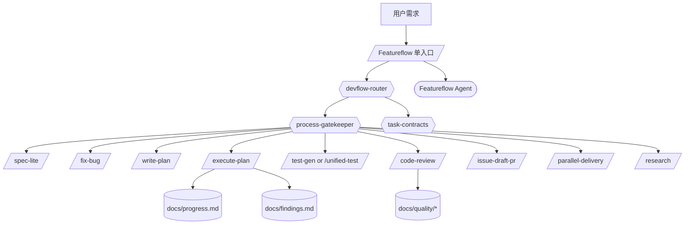
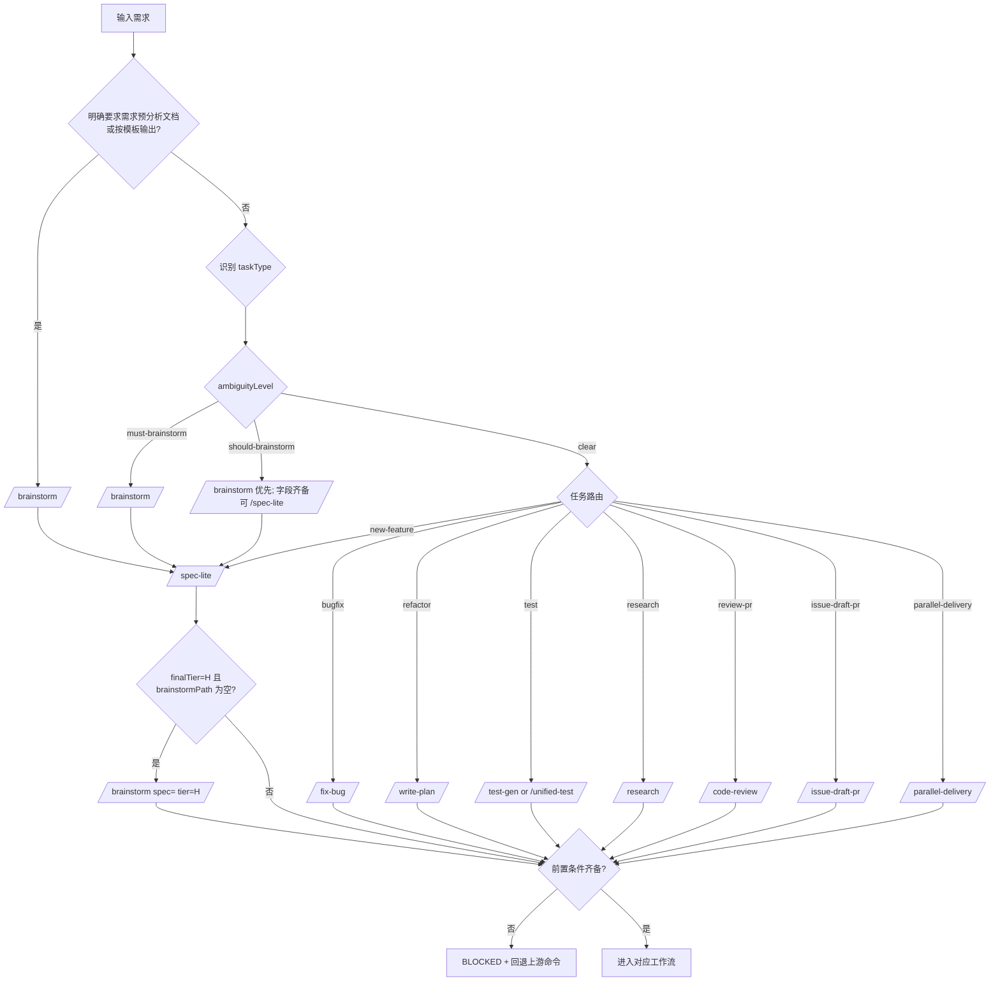

# Featureflow 总控架构图（命令 / Agent / Skill 依赖）

## 智能路由逻辑在哪

`CODEBUDDY.md` 精简后只保留入口与索引，智能路由逻辑在下面 4 个文件：

- 主入口命令编排：`.codebuddy/commands/Featureflow.md`
- 路由规则与决策顺序：`.codebuddy/skills/devflow-router/SKILL.md`
- 路由映射矩阵：`.codebuddy/skills/devflow-router/references/routing-matrix.md`
- 总控代理定义：`.codebuddy/agents/Featureflow.md`

## 图 1：系统分层总览

## 图 2：智能路由决策流

说明：

- H 级支持两条合法路径：`/brainstorm -> /spec-lite -> /write-plan`，以及 `/spec-lite -> /brainstorm -> /write-plan`
- `brainstormPath` 是 H 级进入 `/write-plan` 前的统一证据字段

## 图 3：命令 / Agent / Skill / Rule 依赖图

> 说明：基于 `.codebuddy/commands/*.md` 与 `.codebuddy/agents/*.md` 中显式路径引用整理。

```mermaid
flowchart LR
  subgraph CMD[Commands]
    cmd_Featureflow["/Featureflow"]
    cmd_brainstorm["/brainstorm"]
    cmd_code_review["/code-review"]
    cmd_code_self_check["/code-self-check"]
    cmd_doc_init["/doc-init"]
    cmd_doc_sync["/doc-sync"]
    cmd_execute_plan["/execute-plan"]
    cmd_extend["/extend"]
    cmd_fix_bug["/fix-bug"]
    cmd_issue_draft_pr["/issue-draft-pr"]
    cmd_parallel_delivery["/parallel-delivery"]
    cmd_research["/research"]
    cmd_simplify["/simplify"]
    cmd_spec_lite["/spec-lite"]
    cmd_status["/status"]
    cmd_test_gen["/test-gen"]
    cmd_testcase["/testcase"]
    cmd_unified_test["/unified-test"]
    cmd_write_plan["/write-plan"]
  end

  subgraph AGT[Agents]
    agt_Featureflow(["Featureflow"])
    agt_bug_fixer(["bug-fixer"])
    agt_code_reviewer(["code-reviewer"])
    agt_code_simplifier(["code-simplifier"])
    agt_project_analyzer(["project-analyzer"])
    agt_spec_reviewer(["spec-reviewer"])
    agt_systematic_debugger(["systematic-debugger"])
    agt_task_implementer(["task-implementer"])
    agt_unified_test_agent(["unified-test-agent"])
  end

  subgraph SKL[Skills]
    skl_brainstorming{{brainstorming}}
    skl_bug_fix{{bug-fix}}
    skl_code_review_standards{{code-review-standards}}
    skl_code_self_check{{code-self-check}}
    skl_code_simplifier{{code-simplifier}}
    skl_custom_testing{{custom-testing}}
    skl_devflow_router{{devflow-router}}
    skl_dispatching_parallel_agents{{dispatching-parallel-agents}}
    skl_executing_plans{{executing-plans}}
    skl_extending_project{{extending-project}}
    skl_file_based_memory{{file-based-memory}}
    skl_issue_draft_pr{{issue-draft-pr}}
    skl_parallel_delivery{{parallel-delivery}}
    skl_process_gatekeeper{{process-gatekeeper}}
    skl_receiving_code_review{{receiving-code-review}}
    skl_requesting_code_review{{requesting-code-review}}
    skl_research{{research}}
    skl_spec_lite{{spec-lite}}
    skl_systematic_debugging{{systematic-debugging}}
    skl_task_contracts{{task-contracts}}
    skl_testcase{{testcase}}
    skl_unified_test{{unified-test}}
    skl_using_git_worktrees{{using-git-worktrees}}
    skl_verification_before_completion{{verification-before-completion}}
    skl_web_code_review{{web-code-review}}
    skl_writing_plans{{writing-plans}}
    skl_xlsx{{xlsx}}
  end

  subgraph RUL[Rules]
    rul_code_documentation[[code-documentation]]
    rul_project_reading[[project-reading]]
    rul_test_driven_development[[test-driven-development]]
  end

  cmd_brainstorm --> skl_brainstorming
  cmd_brainstorm --> skl_process_gatekeeper
  cmd_code_review --> skl_code_review_standards
  cmd_code_review --> skl_process_gatekeeper
  cmd_code_review --> skl_web_code_review
  cmd_code_review --> skl_xlsx
  cmd_code_self_check --> skl_code_self_check
  cmd_code_self_check --> skl_process_gatekeeper
  cmd_code_self_check --> skl_receiving_code_review
  cmd_code_self_check --> skl_requesting_code_review
  cmd_doc_init --> rul_code_documentation
  cmd_doc_init --> rul_project_reading
  cmd_doc_sync --> rul_code_documentation
  cmd_execute_plan --> skl_executing_plans
  cmd_execute_plan --> skl_process_gatekeeper
  cmd_extend --> skl_extending_project
  cmd_extend --> skl_process_gatekeeper
  cmd_extend --> rul_project_reading
  cmd_Featureflow --> skl_devflow_router
  cmd_Featureflow --> skl_process_gatekeeper
  cmd_Featureflow --> skl_task_contracts
  cmd_Featureflow --> agt_Featureflow
  cmd_fix_bug --> skl_bug_fix
  cmd_fix_bug --> skl_process_gatekeeper
  cmd_fix_bug --> skl_task_contracts
  cmd_issue_draft_pr --> skl_executing_plans
  cmd_issue_draft_pr --> skl_issue_draft_pr
  cmd_issue_draft_pr --> skl_process_gatekeeper
  cmd_issue_draft_pr --> skl_requesting_code_review
  cmd_issue_draft_pr --> skl_task_contracts
  cmd_issue_draft_pr --> skl_writing_plans
  cmd_parallel_delivery --> skl_dispatching_parallel_agents
  cmd_parallel_delivery --> skl_parallel_delivery
  cmd_parallel_delivery --> skl_process_gatekeeper
  cmd_parallel_delivery --> skl_task_contracts
  cmd_parallel_delivery --> skl_using_git_worktrees
  cmd_research --> skl_file_based_memory
  cmd_research --> skl_process_gatekeeper
  cmd_research --> skl_research
  cmd_simplify --> skl_code_simplifier
  cmd_simplify --> skl_verification_before_completion
  cmd_spec_lite --> skl_file_based_memory
  cmd_spec_lite --> skl_process_gatekeeper
  cmd_spec_lite --> skl_spec_lite
  cmd_spec_lite --> skl_task_contracts
  cmd_status --> skl_file_based_memory
  cmd_status --> skl_process_gatekeeper
  cmd_testcase --> skl_file_based_memory
  cmd_testcase --> skl_process_gatekeeper
  cmd_testcase --> skl_testcase
  cmd_test_gen --> skl_custom_testing
  cmd_test_gen --> skl_process_gatekeeper
  cmd_test_gen --> skl_unified_test
  cmd_test_gen --> rul_test_driven_development
  cmd_unified_test --> skl_process_gatekeeper
  cmd_unified_test --> skl_unified_test
  cmd_unified_test --> rul_test_driven_development
  cmd_write_plan --> skl_process_gatekeeper
  cmd_write_plan --> skl_task_contracts
  cmd_write_plan --> skl_writing_plans

  agt_code_reviewer --> skl_web_code_review
  agt_code_simplifier --> skl_code_simplifier
  agt_systematic_debugger --> skl_systematic_debugging
```

## 命令依赖清单

| Command | Skills | Agents | Rules |
|---|---|---|---|
| `/Featureflow` | `devflow-router`、`process-gatekeeper`、`task-contracts` | `Featureflow` | - |
| `/brainstorm` | `brainstorming`、`process-gatekeeper` | - | - |
| `/code-review` | `code-review-standards`、`process-gatekeeper`、`web-code-review`、`xlsx` | - | - |
| `/code-self-check` | `code-self-check`、`process-gatekeeper`、`receiving-code-review`、`requesting-code-review` | - | - |
| `/doc-init` | - | - | `code-documentation`、`project-reading` |
| `/doc-sync` | - | - | `code-documentation` |
| `/execute-plan` | `executing-plans`、`process-gatekeeper` | - | - |
| `/extend` | `extending-project`、`process-gatekeeper` | - | `project-reading` |
| `/fix-bug` | `bug-fix`、`process-gatekeeper`、`task-contracts` | - | - |
| `/issue-draft-pr` | `executing-plans`、`issue-draft-pr`、`process-gatekeeper`、`requesting-code-review`、`task-contracts`、`writing-plans` | - | - |
| `/parallel-delivery` | `dispatching-parallel-agents`、`parallel-delivery`、`process-gatekeeper`、`task-contracts`、`using-git-worktrees` | - | - |
| `/research` | `file-based-memory`、`process-gatekeeper`、`research` | - | - |
| `/simplify` | `code-simplifier`、`verification-before-completion` | - | - |
| `/spec-lite` | `file-based-memory`、`process-gatekeeper`、`spec-lite`、`task-contracts` | - | - |
| `/status` | `file-based-memory`、`process-gatekeeper` | - | - |
| `/test-gen` | `custom-testing`、`process-gatekeeper`、`unified-test` | - | `test-driven-development` |
| `/testcase` | `file-based-memory`、`process-gatekeeper`、`testcase` | - | - |
| `/unified-test` | `process-gatekeeper`、`unified-test` | - | `test-driven-development` |
| `/write-plan` | `process-gatekeeper`、`task-contracts`、`writing-plans` | - | - |

## 规模统计

- Commands: 19
- Agents: 9
- Skills: 31
