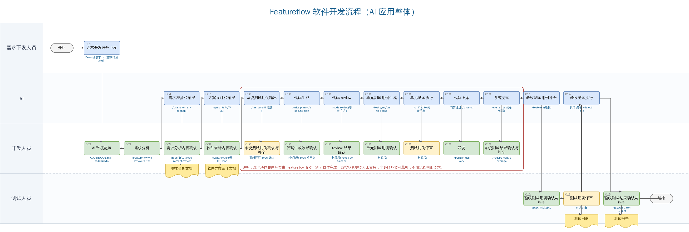

# Featureflow 软件开发流程指导（AI 应用整体）

> 本文是宇视《AI 应用软件开发流程指导》在 **Featureflow** 工作流引擎上的落地版：保持原瀑布式「双层 spec 驱动」的流程骨架，把每个活动对齐到本仓库实际的**命令 / 技能（skill）/ 子代理（agent）/ 规则（rules）/ 硬门禁（process-gatekeeper）**。整体工作流统一命名为 **Featureflow**。
>
> 配套资产：流程图 [`assets/featureflow-swimlane.png`](./assets/featureflow-swimlane.png)（横向泳道）、可编辑源 [`assets/featureflow-swimlane.puml`](./assets/featureflow-swimlane.puml)、位图生成脚本 [`assets/gen_featureflow_swimlane.py`](./assets/gen_featureflow_swimlane.py)。相关文档：[CODEBUDDY.md](../../CODEBUDDY.md)、[README.md](../../README.md)、[ai-feature-flow-mapping.md](../ai-feature-flow-mapping.md)、[featureflow-architecture.md](../architecture/featureflow-architecture.md)。

---

## 1. 目的

随着 AI 在软件工程领域的成熟应用，传统人工进行软件开发的模式已无法满足现代 AI 软件开发的需求。本指导基于瀑布式软件开发流程、应用 **AI 双层 spec**（`spec/Me2AI` 人类输入层 + `spec/AI2AI` AI 过程层）进行需求开发实现的相关说明，旨在建立以 **Featureflow** 引擎驱动的软件开发全流程体系：

- **单入口路由**：一句 `/Featureflow <需求>`，由 `devflow-router` 自动判定任务类型与复杂度并分流。
- **硬门禁治理**：关键节点（写计划 / 执行 / 上库 / 发布）必须满足前置证据，缺证据即 `BLOCKED`，不允许硬推进。
- **文件即记忆**：长任务用 `docs/progress.md` + `docs/findings.md` + `docs/pending-decisions.md` 持久化，防 AI 跑偏、遗忘。
- **四条铁律贯穿**：称呼 Boss、拿不准就问、不写兼容代码、数据铁律（动生产数据需备份 + dry-run + 回滚 + 签字）。

## 2. 适用范围

| | | | |
|---|---|---|---|
| **流程起点** | 需求开发任务下发（`/Featureflow`） | **流程终点** | 验收测试结果确认与测试补全（`/release` · `/status` 收尾） |
| **适用组织范围** | 需进行软件需求实现参与的所有研发人员。 | | |
| **适用业务范围** | 软件开发业务（新功能开发 `/Featureflow`、老项目扩展 `/extend`、缺陷修复 `/fix-bug` · `/defect-loop`）。 | | |

## 3. 流程 KPI

| 指标名称 | 指标定义 | 计算公式 | Featureflow 度量来源 |
|---|---|---|---|
| 需求完整性指数 | 对需求完整实现情况进行度量 | 一轮对话完整被接受=1，二轮=0.8，三轮=0.6，四轮及以上=0.5，超过十轮=0 | `/requirement-coverage` 覆盖审查 + `/score-interaction`（4 维 30 分制） |
| 代码生成准确率 | 对 AI 生成代码准确率进行度量 | AI 生成代码通过测试比例 | `docs/quality/test-summary.json`（通过率）+ `/code-review` 结论 |
| 单元测试覆盖率 | 衡量单元测试覆盖情况 | 测试覆盖代码行数 / 总代码行数 | `/unified-test` · `/test-gen` 覆盖率；CI `test:unit` 阶段 |
| 代码复杂度 | 定义代码复杂度 | 圈复杂度工具测量 | `/code-review` 五维 + `/simplify`（code-simplifier 代理） |
| 验收缺陷密度 | 对代码质量进行评价 | 检测到缺陷 DI 值 / 总代码量 | `/defect-loop`（`bugfix:*` 标签状态机）+ `docs/quality/last-quality-gate.json` |

> 质量门禁事实源统一落在 `docs/quality/*`；接入 GitLab CI 后由 `quality:check` 阶段消费 `test-summary.json` 判通过率 / 覆盖率 / 文档同步，软门禁升级为 **MR 合并阻断**（见 `/ci-setup`）。

## 4. 输入 / 输出

- **输入**：明确的用户需求 —— 落为 `spec/Me2AI/需求描述.md`（固定格式，作为 Plan 驱动全流程的入口）+ `spec/Me2AI/技术约束.md`。
- **输出**：需求实现结果 —— 通过质量门禁、文档与代码同步、可复现证据齐备的交付物（含需求分析文档、软件方案设计文档、测试用例、测试报告）。

## 5. 角色职责

| 角色名称 | 职责内容 |
|---|---|
| **需求下发人员（Boss）** | 1、下发明确的需求任务并负责对需求疑问进行解释（落 `spec/Me2AI/需求描述.md`）；2、在各确认/评审节点签字，对需求实现结果进行确认。 |
| **AI（Featureflow 引擎）** | 代码开发工具，通过 `/Featureflow` 单入口 + `devflow-router` 分流，调度 `agents`（task-implementer / spec-reviewer / code-reviewer …）按 `skills` 定义、受 `rules` 与 `process-gatekeeper` 硬门禁约束，对输入进行系统思考并给出高质量反馈。 |
| **开发人员** | 1、负责需求分析与实现效果核对确认；2、使用 Featureflow 进行需求开发实现（`/spec-lite → /write-plan → /execute-plan`）；3、对 AI 编码结果进行人工审核（`/code-review` 默认只读报问题）并进行必要的测试验证。 |
| **测试人员** | 1、负责需求分析评审与实现效果核对确认；2、使用 Featureflow 进行系统测试与验收测试用例生成与执行（`/testcase` · `/system-test`）；3、对 AI 测试结果进行人工审核并进行必要的内容补全。 |

## 6. 流程图

整体工作流命名为 **Featureflow**。横向泳道 = 角色，从左到右 = 流程；每个活动框下挂对应的 Featureflow 命令 / 技能；红色协同框内为「AI 协同编码与测试环」，可由命令协作完成或按场景人工支持，非必须环节可裁剪。

> 可编辑源见 [`assets/featureflow-swimlane.puml`](./assets/featureflow-swimlane.puml)（PlantUML 活动图，纵向泳道，表达同一流程）。

## 7. 流程活动说明

> 编号沿用原流程；「Featureflow 落地」列给出对应命令 / 技能 / 门禁。带 `(非必须)` 的协同确认环节可按场景裁剪。

| 编号 | 活动名称 | 角色 | Featureflow 落地（命令 / 技能 / 门禁） | 输入 | 活动内容 | 输出 |
|---|---|---|---|---|---|---|
| 001 | 需求开发任务下发 | 需求下发人员 | `spec/Me2AI/需求描述.md`（Plan 入口） | 客户需求电子流 / 版本需求分解 / 内部整改需求 | Boss 将需求下发并整理为固定格式《需求描述.md》 | 明确目标的需求任务 + 团队 + 时间点 |
| 002 | AI 环境配置 | 开发人员 | `CODEBUDDY.md` + `.codebuddy/`（rules 常驻 + skills 仓库 + agents + 双层 spec 约定） | 约束规则、skill 仓库 | 创建项目/用户级规则；导入流程所需 skill；会话启动检测 Git/SVN、平台、GitNexus | 完成配置的 Featureflow 环境 |
| 003 | 需求分析 | 开发人员 | `/Featureflow` 单入口 → `devflow-router` 智能分流 | 需求开发任务 | 按任务类型/复杂度（H/M/L）分流，整理需求功能列表 | 需求分析说明（初稿） |
| 004 | 需求澄清和拓展 | AI | `/brainstorm`（接口涉及平台 OpenAPI → `/openapi`） | 需求分析说明 | AI 澄清模糊需求、拓展补全，生成需求预分析文档 | AI 完善后的需求分析说明文档 |
| 005 | 需求分析内容确认 | 开发人员 | Boss 确认 · `/requirement-review`（四角色模拟评审） | AI 补全的需求分析文档 | 人工确认并按需组织评审，确定终稿 | **《需求分析文档》终稿** |
| 007 | 方案设计和拓展 | AI | `/spec-lite`（H/M/L 分级 + 验收标准 + 技术约束）；H 级补 `/brainstorm` 证据 | 需求分析文档终稿 | AI 进行软件方案设计与拓展，交互确定设计 | 软件设计说明 |
| 008 | 软件设计内容确认 | 开发人员 | `/walkthrough(概要)` 架构/模块边界对齐 · `/spec-check` · Boss 审核 | 软件设计说明 | 确认是否符合架构要求并按需评审，补齐终稿 | **《软件方案设计文档》终稿** |
| 010 | 系统测试用例输出 | AI | `/testcase`（8 维度强制覆盖） | 需求/设计说明终稿 | 指令 AI 输出系统测试用例 | 系统测试用例初稿 |
| 010 | 系统测试用例确认与补全 | 开发人员 | 五维加权评审评分 · Boss 确认 | 系统测试用例初稿 | 人工审视、组织评审、调整补齐 | 系统测试用例终稿 |
| 010 | 代码生成 | AI | `/write-plan` → `/execute-plan`（或 ≥3 任务走子代理驱动）· TDD 规则 | 需求/设计终稿 | 任务分解→门禁→批次执行/子代理严格 TDD 实现 | 符合需求的编码工程 |
| 010 | 代码生成效果确认 *(非必须)* | 开发人员 | Boss 检查点审查 | AI 编码结果 | 人工确认规范符合性与需求完整实现 | 经确认的编码结果 |
| 010 | 代码 review | AI | `/code-review`（增量 · Baseline Commit · 审查立方 3×3×4 · Web/C++ Qt 专项） | 编码结果 | 静态检查 + 多维 review，输出报告；Critical→Issue 闭环 | review 报告 |
| 010 | review 结果确认 *(非必须)* | 开发人员 | Boss 确认 · `/code-self-check` | review 报告 | 人工确认并指令修复（缺陷走 `/defect-loop`） | 修复后的代码 |
| 010 | 单元测试用例生成 | AI | `/test-gen` \| `/unified-test`（按语言自动路由） | review 后代码 | 指令 AI 生成单测用例，交互至达标 | 单元测试用例 |
| 010 | 单元测试用例确认 *(非必须)* | 开发人员 | Boss 确认 | 单测用例 | 人工核对用例完整性 | 经确认的单测用例 |
| 010 | 单元测试执行 | AI | `/unified-test`（覆盖率）· verification-before-completion | 单测用例 | 执行单测，产出报告与覆盖率 | 经单测的代码 + 报告 |
| 010 | 测试用例评审 *(非必须)* | 开发人员 | 评审 skill | 各类测试用例 | 按需组织用例评审 | 评审结论 |
| 010 | 代码上库 | AI | 门禁通过 · `/ci-setup`（MR 5 阶段强门禁） | 经测试代码 | 满足门禁后上库；CI 任一红灯则 MR 合不了 | 上库的需求功能代码 |
| 010 | 联调 | 开发人员 | `/parallel-delivery` · using-git-worktrees | 各模块代码 | 多业务分工开发的需求在此系统联调并修复 | 联调完成的功能代码 |
| 010 | 系统测试 | AI | `/system-test`（端到端 · 发布前硬门禁） | 系统测试用例终稿 | AI 执行系统用例，输出报告 | 系统测试报告初稿 |
| 010 | 系统测试结果确认与补全 | 开发人员 | `/requirement-coverage`（需求覆盖审查）· Boss 评审 | 系统测试报告 | 审视问题、人工补全测试、指令修复 | 经确认的系统测试报告 + 修复 |
| 011 | 验收测试用例补全 | AI | `/testcase`（验收 / 版本用例） | 系统用例终稿 + 验收需求 | 在系统用例基础上补生成拓展验收用例 | 补全后的验收测试用例 |
| 012 | 验收测试用例确认与补全 | 测试人员 | Boss / 测试确认 | AI 验收用例 | 人工确认与补全 | 经确认的验收测试用例 |
| 013 | 测试用例评审 | 测试人员 | 测试评审 | 验收用例 | 组织用例评审 | **《测试用例》** |
| 014 | 验收测试执行 | AI | 执行 · 提问题单 → `/defect-loop`（缺陷闭环） | 经确认的验收用例 | AI 执行验收用例，输出报告并提问题单 | 验收测试报告 + 问题单 |
| 015 | 验收测试结果确认与测试补全 | 测试人员 | `/release` 发布三件套 · `/status` 收尾 · `/doc-sync` · `/spec-sync` 回填 | AI 验收报告 | 人工审核确认、补全测试、形成终稿与发布 | **《测试报告》** 终稿 |

> **主流程最小链路**（详见 `CODEBUDDY.md` 第 4 节）：
> - **L/M 级**：`/spec-lite → /write-plan → /execute-plan → /test-gen|/unified-test → /code-review → /status`
> - **H 级 / 复杂任务**：`/brainstorm → /spec-lite → /walkthrough(概要) → /write-plan → /walkthrough(详细) → /execute-plan → /requirement-coverage → /unified-test → /security-review → /perf-check → /system-test → /code-review → /release → /status`
> - **老项目扩展**：`/extend`（强制 项目理解 → historical-spec → /brainstorm → requirement-analysis 四步前置）

## 8. 补充说明

### 8.1 AI 应用相关术语理解（对齐 Featureflow 实际目录）

- **skill（技能，`.codebuddy/skills/`）**：定义「这一步活该怎么干」。如 `research`（只读研究/检索代码）、`spec-lite`、`writing-plans`、`executing-plans`、`testcase`、`code-review-standards`、`code-self-check`、`process-gatekeeper`（硬门禁）、`file-based-memory`、`task-contracts`、`devflow-router` 等。
- **agent（子代理，`.codebuddy/agents/`）**：干活的「机器人」。如 `task-implementer`（实现）、`spec-reviewer`（规格审查）、`code-reviewer`（代码审查）、`bug-fixer`、`unified-test-agent`、`project-analyzer`、`code-simplifier`、`systematic-debugger`，以及总控 `Featureflow`。特性开发的需求分析 / 方案设计 / 编码 / 代码 review / 单元测试可分别由独立子代理承担，每个子代理拿到对应 skill 清单。
- **Plan（项目经理）**：指导一堆 agent 按 skill 定义的方式，把整件事按 1/2/3/4/5 步骤干完。需要一个固定格式的 `spec/Me2AI/需求描述.md` 作为输入，即可驱动整个流程；中途产物落 `docs/progress.md` / `docs/findings.md`。
- **rules（规则，`.codebuddy/rules/`）**：项目的浓缩信息与潜在要求，相较代码能给 LLM 更准确、精炼的上下文。核心常驻：`verification-before-completion`、`file-based-memory`、`logging-conventions`、`karpathy-guidelines`、`code-comment-conventions`；重型按需加载。**四条铁律**为最高优先级。
- **command（斜杠命令，`.codebuddy/commands/`）**：流程入口。首选单入口 `/Featureflow`，亦可走专用入口（见 README「常用命令速查」）。

### 8.2 AI 应用注意事项

1. **长对话管理**：上下文是有限且昂贵的资源。方法一是开启新会话；方法二是压缩当前会话（`/summarize` 提取关键背景/决策/待解决问题，压缩至原本 15% 以内）；方法三是迁移上下文到新会话；本引擎额外用 **文件即记忆**（`docs/progress.md` / `findings.md` / `pending-decisions.md`）替代上下文窗口做长任务记忆。
2. **固化长期配置**：用 `rules` 和 memory 存储偏好，避免重复说明。
3. **精准引用内容**：只添加相关文件和代码，不要「一股脑全贴」；遵循「项目分析信息源优先级铁律」（三层代码自文档 → GitNexus → 手动四步法）。
4. **合理选择扩展**：优先使用 Skills，谨慎使用 MCP。
5. **定期清理配置**：及时关闭不再需要的扩展和规则；最小核心 = `CODEBUDDY.md` + `verification-before-completion` + `file-based-memory`。
6. **灵活切换模型**：根据任务复杂度和成本要求选择合适的模型。
7. **门禁不可绕过**：关键节点缺前置证据即 `BLOCKED`，必须回退到正确上游步骤，禁止硬推进；动生产数据须先过 `data-safety` 四件套并由 Boss 签字。

### 8.3 skill 应用仓库

- 本仓库技能/命令/子代理/规则统一位于 `.codebuddy/`：`commands/`（斜杠入口）、`skills/`（能力，按需调用）、`agents/`（专职子代理）、`rules/`（规则）。
- 进阶能力：`/ci-setup`（GitLab CI 强门禁）、`/schedule-setup`（7 类定时任务 24×7 无人值守）、`/event-setup`（事件驱动触发）、`/pipeline-watch`（流水线自愈）、`/runner-deploy`（远程部署 Runner）。
- 完整命令清单见 [`CODEBUDDY.md`](../../CODEBUDDY.md#8-常用命令速查) 与 [`README.md`](../../README.md)。

---

> 本指导由 Featureflow 工作流引擎落地，源自宇视《AI 应用软件开发流程指导》与上游 [obra/superpowers](https://github.com/obra/superpowers)；整体工作流统一命名为 **Featureflow**。
